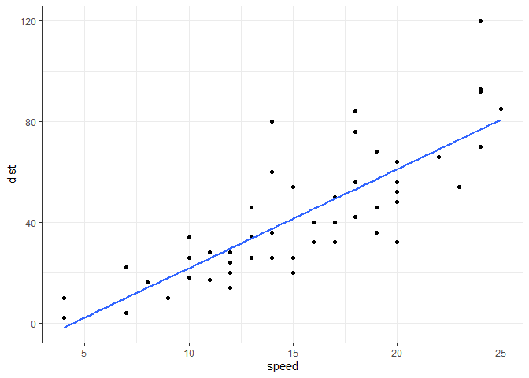
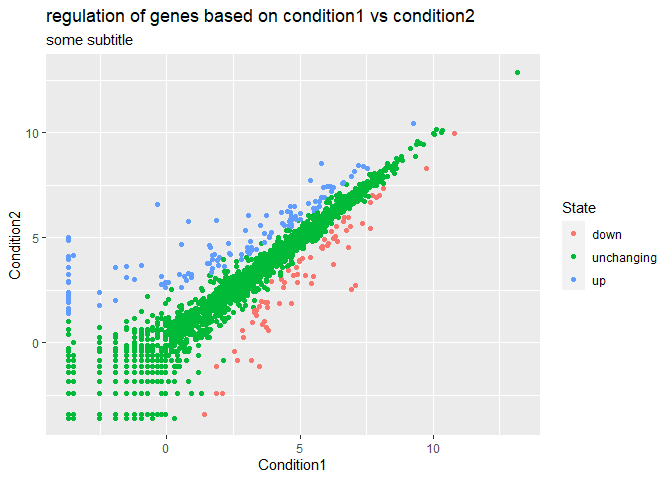
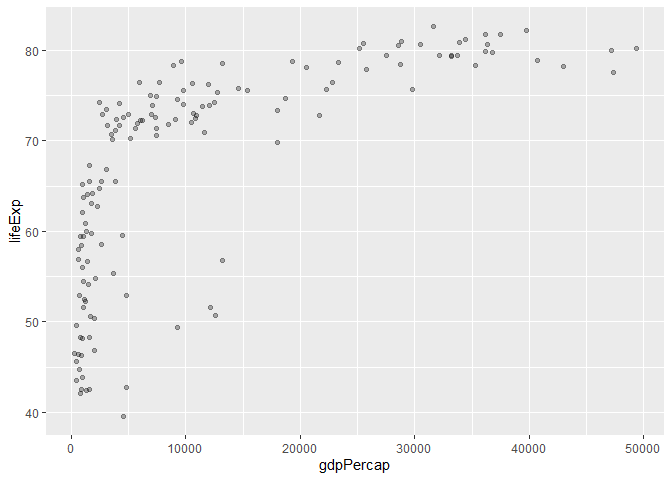
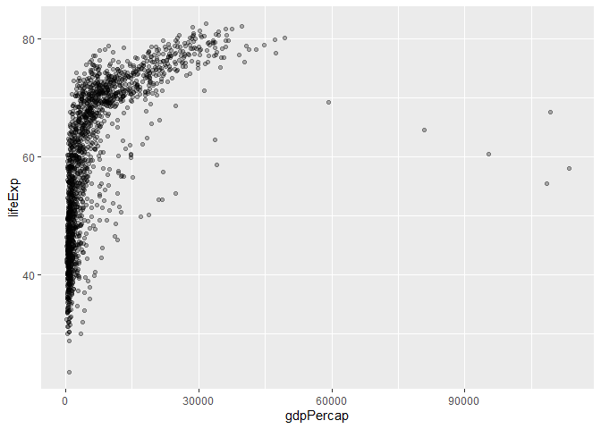
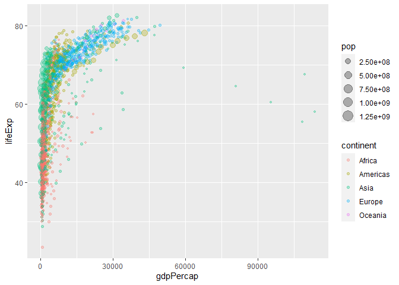
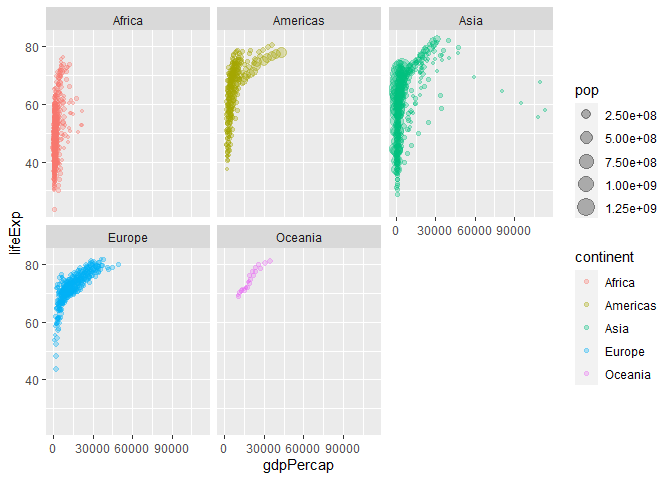

Class 5: Data Visualization
================
Ashlyn

# Plotting in R

R has many plotting and visualization systems, including “base” R.

``` r
head(cars, n = 10)
```

       speed dist
    1      4    2
    2      4   10
    3      7    4
    4      7   22
    5      8   16
    6      9   10
    7     10   18
    8     10   26
    9     10   34
    10    11   17

``` r
plot(cars)
```


ggplot is great for more complex plots.

``` r
#ggplot(cars)
```

To use an add-on, it must first be installed using the function
`install.packages()` with the name of the desired package in
parenthesis. After downloading the package, it needs to be loaded using
the `library` function

``` r
library(ggplot2)
ggplot(cars)
```


ggplot is highly verbose and each ggplot needs at least three things:

- Data: the dataframe of interest

- aesthetics (aes): how the data is mapped to the plot (x axis, y axis,
  etc)

- geometries (geom\_*type*): plot type (ex: geom_point, geom_line, etc)

``` r
ggplot(cars) + 
  aes(x=speed, y=dist) + 
  geom_point() + 
  geom_smooth(se=FALSE, method="lm") +
  theme_bw() 
```

    `geom_smooth()` using formula = 'y ~ x'



## A plot of some genes

``` r
url <- "https://bioboot.github.io/bimm143_S20/class-material/up_down_expression.txt"
genes <- read.delim(url)
head(genes)
```

            Gene Condition1 Condition2      State
    1      A4GNT -3.6808610 -3.4401355 unchanging
    2       AAAS  4.5479580  4.3864126 unchanging
    3      AASDH  3.7190695  3.4787276 unchanging
    4       AATF  5.0784720  5.0151916 unchanging
    5       AATK  0.4711421  0.5598642 unchanging
    6 AB015752.4 -3.6808610 -3.5921390 unchanging

> How many genes are in this dataset?

``` r
nrow(genes)
```

    [1] 5196

There are 5196 genes in this dataset.

> How many genes are upregulated?

``` r
table(genes$State)
```


          down unchanging         up 
            72       4997        127 

or

``` r
sum(genes$State == "up")
```

    [1] 127

``` r
ggplot(genes) +
  aes(x = Condition1, y = Condition2, color = State) +
  geom_point()
```


assign plot to a value so it can easily be edited or layered on later
and then call the value

``` r
p <- ggplot(genes) +
  aes(x = Condition1, y = Condition2, color = State) +
  geom_point()

p
```


change the legend values of p

``` r
p + scale_colour_manual( values=c("blue","gray","red") )
```


give labels using `labs()` (x and y labels, title, etc)

``` r
p + labs(title = "regulation of genes based on condition1 vs condition2", subtitle = "some subtitle")
```



## Gapminder

``` r
library(gapminder)
library(dplyr)
```


    Attaching package: 'dplyr'

    The following objects are masked from 'package:stats':

        filter, lag

    The following objects are masked from 'package:base':

        intersect, setdiff, setequal, union

``` r
gapminder_2007 <- gapminder %>% filter(year==2007)
```

``` r
q <- ggplot(gapminder_2007) +
  aes(x = gdpPercap, y = lifeExp) +
  geom_point(alpha= 0.3)

q
```



> Q. How many countries are in this dataset?

``` r
length( unique(gapminder$country))
```

    [1] 142

> Q. How many years does this dataset span?

``` r
length( unique(gapminder$year))
```

    [1] 12

or

``` r
range(gapminder$year)
```

    [1] 1952 2007

> Q. Which country has the smallest population?

first, where is this min value located in the pop vector?

``` r
ind <- which.min(gapminder$pop)

ind
```

    [1] 1297

which.min (which.max) for the arg min, i.e., the location where an
extreme value occurs.

now use this to access the \$country value for this position

``` r
gapminder$country[ind]
```

    [1] Sao Tome and Principe
    142 Levels: Afghanistan Albania Algeria Angola Argentina Australia ... Zimbabwe

``` r
gapminder[ind,]
```

    # A tibble: 1 × 6
      country               continent  year lifeExp   pop gdpPercap
      <fct>                 <fct>     <int>   <dbl> <int>     <dbl>
    1 Sao Tome and Principe Africa     1952    46.5 60011      880.

``` r
a <- ggplot(gapminder) +
  aes(x=gdpPercap, y=lifeExp) +
  geom_point(alpha=0.3)

a
```



``` r
ggplot(gapminder) +
  aes(x=gdpPercap, y=lifeExp, color = continent, size = pop) +
  geom_point(alpha=0.3)
```



facet by continent

``` r
ggplot(gapminder) +
  aes(x=gdpPercap, y=lifeExp, color = continent, size = pop) +
  geom_point(alpha=0.3) +
  facet_wrap(~continent)
```


