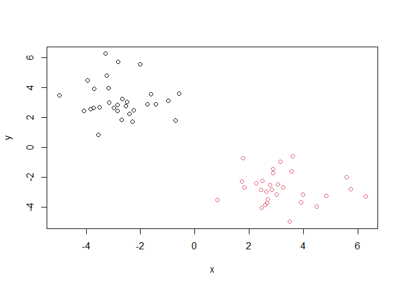
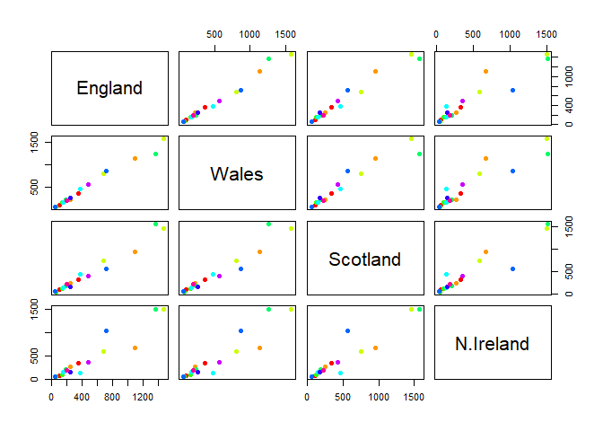

Class 07: Machine Learning 1
================

## Clustering and principal component analysis (PCA)

\#clustering with K-means

made-up data cluster with known results

``` r
hist(rnorm(300000, mean = -3))
```


vecotr with two groupings in it:

``` r
tmp <- c(rnorm(30, -3), rnorm(30, +3))
tmp
```

     [1] -3.1488384 -2.2602269 -1.6193487 -3.2756696 -3.2420761 -3.7153809
     [7] -2.9841430 -3.5006367 -2.0029234 -2.5449931 -3.5436069 -3.7023045
    [13] -4.9861439 -1.7350074 -2.4992060 -2.8543230 -2.6792337 -0.5835540
    [19] -0.9673490 -3.9512589 -2.6814624 -2.3974071 -4.0666261 -2.8528469
    [25] -2.2899372 -2.8145133 -3.8383713 -3.1676936 -0.7062904 -1.4316009
    [31]  2.8770500  1.7861968  3.9852724  2.5856487  5.7461944  1.7374601
    [37]  2.8393511  2.4559381  2.2514038  1.8300158  4.4738217  3.1416072
    [43]  3.6035046  3.2418079  2.4277276  3.0599388  2.8769095  3.5022789
    [49]  3.9160304  0.8330633  2.7649624  5.5762206  2.6749530  2.6443856
    [55]  2.6629563  4.8317403  6.2793618  3.5627186  2.4816103  3.0000688

``` r
x <- data.frame(x=tmp, y=rev(tmp))
x
```

                x          y
    1  -3.1488384  3.0000688
    2  -2.2602269  2.4816103
    3  -1.6193487  3.5627186
    4  -3.2756696  6.2793618
    5  -3.2420761  4.8317403
    6  -3.7153809  2.6629563
    7  -2.9841430  2.6443856
    8  -3.5006367  2.6749530
    9  -2.0029234  5.5762206
    10 -2.5449931  2.7649624
    11 -3.5436069  0.8330633
    12 -3.7023045  3.9160304
    13 -4.9861439  3.5022789
    14 -1.7350074  2.8769095
    15 -2.4992060  3.0599388
    16 -2.8543230  2.4277276
    17 -2.6792337  3.2418079
    18 -0.5835540  3.6035046
    19 -0.9673490  3.1416072
    20 -3.9512589  4.4738217
    21 -2.6814624  1.8300158
    22 -2.3974071  2.2514038
    23 -4.0666261  2.4559381
    24 -2.8528469  2.8393511
    25 -2.2899372  1.7374601
    26 -2.8145133  5.7461944
    27 -3.8383713  2.5856487
    28 -3.1676936  3.9852724
    29 -0.7062904  1.7861968
    30 -1.4316009  2.8770500
    31  2.8770500 -1.4316009
    32  1.7861968 -0.7062904
    33  3.9852724 -3.1676936
    34  2.5856487 -3.8383713
    35  5.7461944 -2.8145133
    36  1.7374601 -2.2899372
    37  2.8393511 -2.8528469
    38  2.4559381 -4.0666261
    39  2.2514038 -2.3974071
    40  1.8300158 -2.6814624
    41  4.4738217 -3.9512589
    42  3.1416072 -0.9673490
    43  3.6035046 -0.5835540
    44  3.2418079 -2.6792337
    45  2.4277276 -2.8543230
    46  3.0599388 -2.4992060
    47  2.8769095 -1.7350074
    48  3.5022789 -4.9861439
    49  3.9160304 -3.7023045
    50  0.8330633 -3.5436069
    51  2.7649624 -2.5449931
    52  5.5762206 -2.0029234
    53  2.6749530 -3.5006367
    54  2.6443856 -2.9841430
    55  2.6629563 -3.7153809
    56  4.8317403 -3.2420761
    57  6.2793618 -3.2756696
    58  3.5627186 -1.6193487
    59  2.4816103 -2.2602269
    60  3.0000688 -3.1488384

``` r
plot(x)
```


``` r
km <- kmeans(x, 2)

km
```

    K-means clustering with 2 clusters of sizes 30, 30

    Cluster means:
              x         y
    1 -2.734766  3.188340
    2  3.188340 -2.734766

    Clustering vector:
     [1] 1 1 1 1 1 1 1 1 1 1 1 1 1 1 1 1 1 1 1 1 1 1 1 1 1 1 1 1 1 1 2 2 2 2 2 2 2 2
    [39] 2 2 2 2 2 2 2 2 2 2 2 2 2 2 2 2 2 2 2 2 2 2

    Within cluster sum of squares by cluster:
    [1] 74.09674 74.09674
     (between_SS / total_SS =  87.7 %)

    Available components:

    [1] "cluster"      "centers"      "totss"        "withinss"     "tot.withinss"
    [6] "betweenss"    "size"         "iter"         "ifault"      

its important to also be able to get the important results back in a way
we can do things with

> Q. How do we get the cluster size?

``` r
km$size
```

    [1] 30 30

> Q. How do we get the cluster center?

``` r
km$centers
```

              x         y
    1 -2.734766  3.188340
    2  3.188340 -2.734766

> Q. How do we get the main result, the cluster assignment vector?

``` r
km$cluster
```

     [1] 1 1 1 1 1 1 1 1 1 1 1 1 1 1 1 1 1 1 1 1 1 1 1 1 1 1 1 1 1 1 2 2 2 2 2 2 2 2
    [39] 2 2 2 2 2 2 2 2 2 2 2 2 2 2 2 2 2 2 2 2 2 2

> Q. Can we make a summary figure showing the clustering result colored
> by clustering assignment and the cluster centers in a different color?

``` r
plot(x, col = "red" )
```


``` r
plot(x, col = km$cluster)  #this works bc you can number by color!
```



``` r
library(ggplot2)
```

``` r
ggplot(x) +
  aes(x, y) +
  geom_point(color = km$cluster)
```


``` r
# make up a color vector

mycols <- rep("grey", 60)
mycols
```

     [1] "grey" "grey" "grey" "grey" "grey" "grey" "grey" "grey" "grey" "grey"
    [11] "grey" "grey" "grey" "grey" "grey" "grey" "grey" "grey" "grey" "grey"
    [21] "grey" "grey" "grey" "grey" "grey" "grey" "grey" "grey" "grey" "grey"
    [31] "grey" "grey" "grey" "grey" "grey" "grey" "grey" "grey" "grey" "grey"
    [41] "grey" "grey" "grey" "grey" "grey" "grey" "grey" "grey" "grey" "grey"
    [51] "grey" "grey" "grey" "grey" "grey" "grey" "grey" "grey" "grey" "grey"

``` r
plot(x, col = mycols)
```


lets highlight points 10, 12 and 20 in red

``` r
mycols[c(10,12,20)] <- "red"
```

``` r
plot(x, col = mycols, pch = 18)
```


play with the cluster numbers and kmeans

kmeans “imposes” a 3 cluster structure onto the data

``` r
km <- kmeans(x, 3)
km
```

    K-means clustering with 3 clusters of sizes 30, 22, 8

    Cluster means:
              x         y
    1  3.188340 -2.734766
    2 -2.495472  2.606331
    3 -3.392823  4.788865

    Clustering vector:
     [1] 2 2 2 3 3 2 2 2 3 2 2 3 3 2 2 2 2 2 2 3 2 2 2 2 2 3 2 3 2 2 1 1 1 1 1 1 1 1
    [39] 1 1 1 1 1 1 1 1 1 1 1 1 1 1 1 1 1 1 1 1 1 1

    Within cluster sum of squares by cluster:
    [1] 74.09674 29.20539 12.22168
     (between_SS / total_SS =  90.4 %)

    Available components:

    [1] "cluster"      "centers"      "totss"        "withinss"     "tot.withinss"
    [6] "betweenss"    "size"         "iter"         "ifault"      

``` r
plot(x, col = km$cluster)
```


keep track of the *total withinss* score to know how good the clustering
is

``` r
km$tot.withinss
```

    [1] 115.5238

trying out different numbers of K from 1 to 7. We can write a `for`loop
to do this for us, and store the `$tot.withinss` each time

``` r
tot_ss <- NULL

k <- 1:7

for(i in k) {
  #calculates kmean of x for k (the number of clusters) from 1:7 and saving the $tot.withinss part of the kmeans return to tot_ss
  tot_ss <- c(tot_ss, kmeans(x, centers = i)$tot.withinss)
}
```

``` r
totss <-  NULL

k <- 1:7

for (i in k) {
  
}
```

``` r
plot(tot_ss, type = "o")
```


# Hierarchical clustering

we cant just give the `hclust()` fucntion of input data `x` like we did
for `kmeans()`. We need to first calculate a *distance matrix* with the
`dist()` function which will calculate the euclidean distance by
default.

``` r
d <- dist(x)

hc <- hclust(d)
hc
```


    Call:
    hclust(d = d)

    Cluster method   : complete 
    Distance         : euclidean 
    Number of objects: 60 

the default print out isnt very helpful, but the plot method is

``` r
plot(hc)
```


hierarchical clusterinig is bottom up. Cross bar heights represent how
close each point/cluster is to another. The taller the cross bar height,
the further away the points/clusters are from each other.

``` r
plot(hc)
abline(h=10, col = "red", lty=2)
```


to get the important cluster membership vector out of hclust object, use
`cutree()`

``` r
cutree(hc, h = 10) # cuts tree at height 10 and returns cluster assignement vector
```

     [1] 1 1 1 1 1 1 1 1 1 1 1 1 1 1 1 1 1 1 1 1 1 1 1 1 1 1 1 1 1 1 2 2 2 2 2 2 2 2
    [39] 2 2 2 2 2 2 2 2 2 2 2 2 2 2 2 2 2 2 2 2 2 2

you can also set a `k=` argument to `cutree()`

``` r
groups <- cutree(hc, k = 3) # cuts tree to yield 3 groups
```

``` r
plot(x, col = groups)
```


``` r
ggplot(x) +
  aes(x,y) +
  geom_point(color = groups)
```


# Principal component analysis (PCA)

The main base R function to do PCA is called `prcomp()`

(dimensions = number of things being measured = number of columns; not
all dimensions of a dataset are equally important to understand the
dataset)

PCA projects the features onto the principal components (PC’s) which
reduces the dimensionality while only losing a little bit of data

First principal component (PC1) follows a “best fit” line through the
data points. Covers most of the spread (max variance)

The second principal component (PC2) covers the rest.

PC1 and PC2 become the new low dimensional axis/surfaces closest to the
data.

PCA reduces dimensionality, helps visualize multidimensional data,
choose most useful vars (features), identify groupings & identify
outliers.

\#PCA UK Food Data

``` r
url <- "https://tinyurl.com/UK-foods"
x <- read.csv(url)
x
```

                         X England Wales Scotland N.Ireland
    1               Cheese     105   103      103        66
    2        Carcass_meat      245   227      242       267
    3          Other_meat      685   803      750       586
    4                 Fish     147   160      122        93
    5       Fats_and_oils      193   235      184       209
    6               Sugars     156   175      147       139
    7      Fresh_potatoes      720   874      566      1033
    8           Fresh_Veg      253   265      171       143
    9           Other_Veg      488   570      418       355
    10 Processed_potatoes      198   203      220       187
    11      Processed_Veg      360   365      337       334
    12        Fresh_fruit     1102  1137      957       674
    13            Cereals     1472  1582     1462      1494
    14           Beverages      57    73       53        47
    15        Soft_drinks     1374  1256     1572      1506
    16   Alcoholic_drinks      375   475      458       135
    17      Confectionery       54    64       62        41

> Q1. How many rows and columns are in your new data frame named x? What
> R functions could you use to answer this questions?

``` r
dim(x)
```

    [1] 17  5

(dangerous code below for rownames)

``` r
rownames(x) <- x[,1]
x <- x[,-1]
head(x)
```

                   England Wales Scotland N.Ireland
    Cheese             105   103      103        66
    Carcass_meat       245   227      242       267
    Other_meat         685   803      750       586
    Fish               147   160      122        93
    Fats_and_oils      193   235      184       209
    Sugars             156   175      147       139

better to just read it again with the `row.names=1` argument

``` r
x <- read.csv(url, row.names = 1)
x
```

                        England Wales Scotland N.Ireland
    Cheese                  105   103      103        66
    Carcass_meat            245   227      242       267
    Other_meat              685   803      750       586
    Fish                    147   160      122        93
    Fats_and_oils           193   235      184       209
    Sugars                  156   175      147       139
    Fresh_potatoes          720   874      566      1033
    Fresh_Veg               253   265      171       143
    Other_Veg               488   570      418       355
    Processed_potatoes      198   203      220       187
    Processed_Veg           360   365      337       334
    Fresh_fruit            1102  1137      957       674
    Cereals                1472  1582     1462      1494
    Beverages                57    73       53        47
    Soft_drinks            1374  1256     1572      1506
    Alcoholic_drinks        375   475      458       135
    Confectionery            54    64       62        41

> Q2. Which approach to solving the ‘row-names problem’ mentioned above
> do you prefer and why? Is one approach more robust than another under
> certain circumstances?

the `row.names` approach is better because it saves time and you dont
run the risk of accidentally deleting rows.

``` r
barplot(as.matrix(x), beside=T, col=rainbow(nrow(x)))
```


> Q3: Changing what optional argument in the above barplot() function
> results in the following plot?

``` r
barplot(as.matrix(x), beside = F, col=rainbow(nrow(x)))
```


changing beside=T to beside=F gives you this plot

> Q5: Generating all pairwise plots may help somewhat. Can you make
> sense of the following code and resulting figure? What does it mean if
> a given point lies on the diagonal for a given plot?

``` r
pairs(x, col=rainbow(10), pch=16)
```



if a given point is on the diagonal for a given plot it means that it
correlates to another country. it is the possible pairwise scatter

> Q6. What is the main differences between N. Ireland and the other
> countries of the UK in terms of this data-set?

the main difference between N ireland and the other countries is the
blue point is higher in ireland than the rest of the countries, while
orange point is higher in the other countries than ireland

PCA

pca needs transpose of the food data

``` r
pca <- prcomp(t(x))
summary(pca)
```

    Importance of components:
                                PC1      PC2      PC3       PC4
    Standard deviation     324.1502 212.7478 73.87622 4.189e-14
    Proportion of Variance   0.6744   0.2905  0.03503 0.000e+00
    Cumulative Proportion    0.6744   0.9650  1.00000 1.000e+00

PC1 captures 67% of the variance, PC2 has

cumulative proportion adds the component proportions of variance PC1 +
PC2 which covers 96%

``` r
attributes(pca)
```

    $names
    [1] "sdev"     "rotation" "center"   "scale"    "x"       

    $class
    [1] "prcomp"

``` r
pca$x
```

                     PC1         PC2         PC3           PC4
    England   -144.99315    2.532999 -105.768945  2.842865e-14
    Wales     -240.52915  224.646925   56.475555  7.804382e-13
    Scotland   -91.86934 -286.081786   44.415495 -9.614462e-13
    N.Ireland  477.39164   58.901862    4.877895  1.448078e-13

shows what the data looks like along the new PCA axes

> Q7. Complete the code below to generate a plot of PC1 vs PC2. The
> second line adds text labels over the data points.

PC1 vs PC2 plot or “score” plot, “PCA” plot

``` r
mycols <- c("orange", "red", "blue", "green")
plot(pca$x[,1], pca$x[,2], xlab="PC1", ylab="PC2", xlim=c(-270,500), col = mycols, pch = 16, cex = 2)

abline(h=0)
```


``` r
abline
```

    function (a = NULL, b = NULL, h = NULL, v = NULL, reg = NULL, 
        coef = NULL, untf = FALSE, ...) 
    {
        int_abline <- function(a, b, h, v, untf, col = par("col"), 
            lty = par("lty"), lwd = par("lwd"), ...) .External.graphics(C_abline, 
            a, b, h, v, untf, col, lty, lwd, ...)
        if (!is.null(reg)) {
            if (!is.null(a)) 
                warning("'a' is overridden by 'reg'")
            a <- reg
        }
        if (is.object(a) || is.list(a)) {
            p <- length(coefa <- as.vector(coef(a)))
            if (p > 2) 
                warning(gettextf("only using the first two of %d regression coefficients", 
                    p), domain = NA)
            islm <- inherits(a, "lm")
            noInt <- if (islm) 
                !as.logical(attr(stats::terms(a), "intercept"))
            else p == 1
            if (noInt) {
                a <- 0
                b <- coefa[1L]
            }
            else {
                a <- coefa[1L]
                b <- if (p >= 2) 
                    coefa[2L]
                else 0
            }
        }
        if (!is.null(coef)) {
            if (!is.null(a)) 
                warning("'a' and 'b' are overridden by 'coef'")
            a <- coef[1L]
            b <- coef[2L]
        }
        int_abline(a = a, b = b, h = h, v = v, untf = untf, ...)
        invisible()
    }
    <bytecode: 0x00000191e5430230>
    <environment: namespace:graphics>

``` r
#text(pca$x[,1], pca$x[,2], colnames(x))
```

``` r
pc <- as.data.frame(pca$x)

ggplot(pc) +
  aes(PC1,PC2) +
  geom_point(color=mycols, size = 5)
```


Lets look at how the original variables contribute to our new axis of
max variance, aka PC’s

``` r
pca$rotation
```

                                 PC1          PC2         PC3          PC4
    Cheese              -0.056955380 -0.016012850 -0.02394295 -0.691718038
    Carcass_meat         0.047927628 -0.013915823 -0.06367111  0.635384915
    Other_meat          -0.258916658  0.015331138  0.55384854  0.198175921
    Fish                -0.084414983  0.050754947 -0.03906481 -0.015824630
    Fats_and_oils       -0.005193623  0.095388656  0.12522257  0.052347444
    Sugars              -0.037620983  0.043021699  0.03605745  0.014481347
    Fresh_potatoes       0.401402060  0.715017078  0.20668248 -0.151706089
    Fresh_Veg           -0.151849942  0.144900268 -0.21382237  0.056182433
    Other_Veg           -0.243593729  0.225450923  0.05332841 -0.080722623
    Processed_potatoes  -0.026886233 -0.042850761  0.07364902 -0.022618707
    Processed_Veg       -0.036488269  0.045451802 -0.05289191  0.009235001
    Fresh_fruit         -0.632640898  0.177740743 -0.40012865 -0.021899087
    Cereals             -0.047702858  0.212599678  0.35884921  0.084667257
    Beverages           -0.026187756  0.030560542  0.04135860 -0.011880823
    Soft_drinks          0.232244140 -0.555124311  0.16942648 -0.144367046
    Alcoholic_drinks    -0.463968168 -0.113536523  0.49858320 -0.115797605
    Confectionery       -0.029650201 -0.005949921  0.05232164 -0.003695024

``` r
loadings <- as.data.frame(pca$rotation)

ggplot(loadings) +
  aes(PC1, rownames(loadings)) +
  geom_col()
```


positive contributions are things ireland has more of in the scatter
plot

negative things are things the other countries have more of in the
scatter
