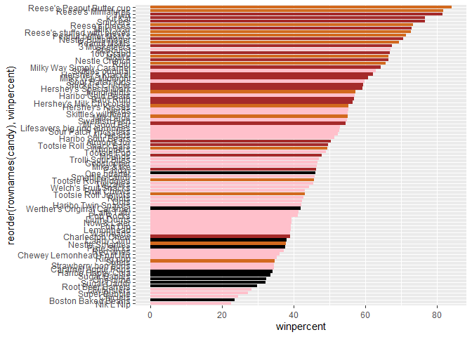

Class10_candy
================
Ashlyn Murphy

Candyyyyy data(!!!) with PCA methods

\#import the data

``` r
candy <- read.csv("candy-data.csv", row.names = 1)
candy
```

                                chocolate fruity caramel peanutyalmondy nougat
    100 Grand                           1      0       1              0      0
    3 Musketeers                        1      0       0              0      1
    One dime                            0      0       0              0      0
    One quarter                         0      0       0              0      0
    Air Heads                           0      1       0              0      0
    Almond Joy                          1      0       0              1      0
    Baby Ruth                           1      0       1              1      1
    Boston Baked Beans                  0      0       0              1      0
    Candy Corn                          0      0       0              0      0
    Caramel Apple Pops                  0      1       1              0      0
    Charleston Chew                     1      0       0              0      1
    Chewey Lemonhead Fruit Mix          0      1       0              0      0
    Chiclets                            0      1       0              0      0
    Dots                                0      1       0              0      0
    Dum Dums                            0      1       0              0      0
    Fruit Chews                         0      1       0              0      0
    Fun Dip                             0      1       0              0      0
    Gobstopper                          0      1       0              0      0
    Haribo Gold Bears                   0      1       0              0      0
    Haribo Happy Cola                   0      0       0              0      0
    Haribo Sour Bears                   0      1       0              0      0
    Haribo Twin Snakes                  0      1       0              0      0
    Hershey's Kisses                    1      0       0              0      0
    Hershey's Krackel                   1      0       0              0      0
    Hershey's Milk Chocolate            1      0       0              0      0
    Hershey's Special Dark              1      0       0              0      0
    Jawbusters                          0      1       0              0      0
    Junior Mints                        1      0       0              0      0
    Kit Kat                             1      0       0              0      0
    Laffy Taffy                         0      1       0              0      0
    Lemonhead                           0      1       0              0      0
    Lifesavers big ring gummies         0      1       0              0      0
    Peanut butter M&M's                 1      0       0              1      0
    M&M's                               1      0       0              0      0
    Mike & Ike                          0      1       0              0      0
    Milk Duds                           1      0       1              0      0
    Milky Way                           1      0       1              0      1
    Milky Way Midnight                  1      0       1              0      1
    Milky Way Simply Caramel            1      0       1              0      0
    Mounds                              1      0       0              0      0
    Mr Good Bar                         1      0       0              1      0
    Nerds                               0      1       0              0      0
    Nestle Butterfinger                 1      0       0              1      0
    Nestle Crunch                       1      0       0              0      0
    Nik L Nip                           0      1       0              0      0
    Now & Later                         0      1       0              0      0
    Payday                              0      0       0              1      1
    Peanut M&Ms                         1      0       0              1      0
    Pixie Sticks                        0      0       0              0      0
    Pop Rocks                           0      1       0              0      0
    Red vines                           0      1       0              0      0
    Reese's Miniatures                  1      0       0              1      0
    Reese's Peanut Butter cup           1      0       0              1      0
    Reese's pieces                      1      0       0              1      0
    Reese's stuffed with pieces         1      0       0              1      0
    Ring pop                            0      1       0              0      0
    Rolo                                1      0       1              0      0
    Root Beer Barrels                   0      0       0              0      0
    Runts                               0      1       0              0      0
    Sixlets                             1      0       0              0      0
    Skittles original                   0      1       0              0      0
    Skittles wildberry                  0      1       0              0      0
    Nestle Smarties                     1      0       0              0      0
    Smarties candy                      0      1       0              0      0
    Snickers                            1      0       1              1      1
    Snickers Crisper                    1      0       1              1      0
    Sour Patch Kids                     0      1       0              0      0
    Sour Patch Tricksters               0      1       0              0      0
    Starburst                           0      1       0              0      0
    Strawberry bon bons                 0      1       0              0      0
    Sugar Babies                        0      0       1              0      0
    Sugar Daddy                         0      0       1              0      0
    Super Bubble                        0      1       0              0      0
    Swedish Fish                        0      1       0              0      0
    Tootsie Pop                         1      1       0              0      0
    Tootsie Roll Juniors                1      0       0              0      0
    Tootsie Roll Midgies                1      0       0              0      0
    Tootsie Roll Snack Bars             1      0       0              0      0
    Trolli Sour Bites                   0      1       0              0      0
    Twix                                1      0       1              0      0
    Twizzlers                           0      1       0              0      0
    Warheads                            0      1       0              0      0
    Welch's Fruit Snacks                0      1       0              0      0
    Werther's Original Caramel          0      0       1              0      0
    Whoppers                            1      0       0              0      0
                                crispedricewafer hard bar pluribus sugarpercent
    100 Grand                                  1    0   1        0        0.732
    3 Musketeers                               0    0   1        0        0.604
    One dime                                   0    0   0        0        0.011
    One quarter                                0    0   0        0        0.011
    Air Heads                                  0    0   0        0        0.906
    Almond Joy                                 0    0   1        0        0.465
    Baby Ruth                                  0    0   1        0        0.604
    Boston Baked Beans                         0    0   0        1        0.313
    Candy Corn                                 0    0   0        1        0.906
    Caramel Apple Pops                         0    0   0        0        0.604
    Charleston Chew                            0    0   1        0        0.604
    Chewey Lemonhead Fruit Mix                 0    0   0        1        0.732
    Chiclets                                   0    0   0        1        0.046
    Dots                                       0    0   0        1        0.732
    Dum Dums                                   0    1   0        0        0.732
    Fruit Chews                                0    0   0        1        0.127
    Fun Dip                                    0    1   0        0        0.732
    Gobstopper                                 0    1   0        1        0.906
    Haribo Gold Bears                          0    0   0        1        0.465
    Haribo Happy Cola                          0    0   0        1        0.465
    Haribo Sour Bears                          0    0   0        1        0.465
    Haribo Twin Snakes                         0    0   0        1        0.465
    Hershey's Kisses                           0    0   0        1        0.127
    Hershey's Krackel                          1    0   1        0        0.430
    Hershey's Milk Chocolate                   0    0   1        0        0.430
    Hershey's Special Dark                     0    0   1        0        0.430
    Jawbusters                                 0    1   0        1        0.093
    Junior Mints                               0    0   0        1        0.197
    Kit Kat                                    1    0   1        0        0.313
    Laffy Taffy                                0    0   0        0        0.220
    Lemonhead                                  0    1   0        0        0.046
    Lifesavers big ring gummies                0    0   0        0        0.267
    Peanut butter M&M's                        0    0   0        1        0.825
    M&M's                                      0    0   0        1        0.825
    Mike & Ike                                 0    0   0        1        0.872
    Milk Duds                                  0    0   0        1        0.302
    Milky Way                                  0    0   1        0        0.604
    Milky Way Midnight                         0    0   1        0        0.732
    Milky Way Simply Caramel                   0    0   1        0        0.965
    Mounds                                     0    0   1        0        0.313
    Mr Good Bar                                0    0   1        0        0.313
    Nerds                                      0    1   0        1        0.848
    Nestle Butterfinger                        0    0   1        0        0.604
    Nestle Crunch                              1    0   1        0        0.313
    Nik L Nip                                  0    0   0        1        0.197
    Now & Later                                0    0   0        1        0.220
    Payday                                     0    0   1        0        0.465
    Peanut M&Ms                                0    0   0        1        0.593
    Pixie Sticks                               0    0   0        1        0.093
    Pop Rocks                                  0    1   0        1        0.604
    Red vines                                  0    0   0        1        0.581
    Reese's Miniatures                         0    0   0        0        0.034
    Reese's Peanut Butter cup                  0    0   0        0        0.720
    Reese's pieces                             0    0   0        1        0.406
    Reese's stuffed with pieces                0    0   0        0        0.988
    Ring pop                                   0    1   0        0        0.732
    Rolo                                       0    0   0        1        0.860
    Root Beer Barrels                          0    1   0        1        0.732
    Runts                                      0    1   0        1        0.872
    Sixlets                                    0    0   0        1        0.220
    Skittles original                          0    0   0        1        0.941
    Skittles wildberry                         0    0   0        1        0.941
    Nestle Smarties                            0    0   0        1        0.267
    Smarties candy                             0    1   0        1        0.267
    Snickers                                   0    0   1        0        0.546
    Snickers Crisper                           1    0   1        0        0.604
    Sour Patch Kids                            0    0   0        1        0.069
    Sour Patch Tricksters                      0    0   0        1        0.069
    Starburst                                  0    0   0        1        0.151
    Strawberry bon bons                        0    1   0        1        0.569
    Sugar Babies                               0    0   0        1        0.965
    Sugar Daddy                                0    0   0        0        0.418
    Super Bubble                               0    0   0        0        0.162
    Swedish Fish                               0    0   0        1        0.604
    Tootsie Pop                                0    1   0        0        0.604
    Tootsie Roll Juniors                       0    0   0        0        0.313
    Tootsie Roll Midgies                       0    0   0        1        0.174
    Tootsie Roll Snack Bars                    0    0   1        0        0.465
    Trolli Sour Bites                          0    0   0        1        0.313
    Twix                                       1    0   1        0        0.546
    Twizzlers                                  0    0   0        0        0.220
    Warheads                                   0    1   0        0        0.093
    Welch's Fruit Snacks                       0    0   0        1        0.313
    Werther's Original Caramel                 0    1   0        0        0.186
    Whoppers                                   1    0   0        1        0.872
                                pricepercent winpercent
    100 Grand                          0.860   66.97173
    3 Musketeers                       0.511   67.60294
    One dime                           0.116   32.26109
    One quarter                        0.511   46.11650
    Air Heads                          0.511   52.34146
    Almond Joy                         0.767   50.34755
    Baby Ruth                          0.767   56.91455
    Boston Baked Beans                 0.511   23.41782
    Candy Corn                         0.325   38.01096
    Caramel Apple Pops                 0.325   34.51768
    Charleston Chew                    0.511   38.97504
    Chewey Lemonhead Fruit Mix         0.511   36.01763
    Chiclets                           0.325   24.52499
    Dots                               0.511   42.27208
    Dum Dums                           0.034   39.46056
    Fruit Chews                        0.034   43.08892
    Fun Dip                            0.325   39.18550
    Gobstopper                         0.453   46.78335
    Haribo Gold Bears                  0.465   57.11974
    Haribo Happy Cola                  0.465   34.15896
    Haribo Sour Bears                  0.465   51.41243
    Haribo Twin Snakes                 0.465   42.17877
    Hershey's Kisses                   0.093   55.37545
    Hershey's Krackel                  0.918   62.28448
    Hershey's Milk Chocolate           0.918   56.49050
    Hershey's Special Dark             0.918   59.23612
    Jawbusters                         0.511   28.12744
    Junior Mints                       0.511   57.21925
    Kit Kat                            0.511   76.76860
    Laffy Taffy                        0.116   41.38956
    Lemonhead                          0.104   39.14106
    Lifesavers big ring gummies        0.279   52.91139
    Peanut butter M&M's                0.651   71.46505
    M&M's                              0.651   66.57458
    Mike & Ike                         0.325   46.41172
    Milk Duds                          0.511   55.06407
    Milky Way                          0.651   73.09956
    Milky Way Midnight                 0.441   60.80070
    Milky Way Simply Caramel           0.860   64.35334
    Mounds                             0.860   47.82975
    Mr Good Bar                        0.918   54.52645
    Nerds                              0.325   55.35405
    Nestle Butterfinger                0.767   70.73564
    Nestle Crunch                      0.767   66.47068
    Nik L Nip                          0.976   22.44534
    Now & Later                        0.325   39.44680
    Payday                             0.767   46.29660
    Peanut M&Ms                        0.651   69.48379
    Pixie Sticks                       0.023   37.72234
    Pop Rocks                          0.837   41.26551
    Red vines                          0.116   37.34852
    Reese's Miniatures                 0.279   81.86626
    Reese's Peanut Butter cup          0.651   84.18029
    Reese's pieces                     0.651   73.43499
    Reese's stuffed with pieces        0.651   72.88790
    Ring pop                           0.965   35.29076
    Rolo                               0.860   65.71629
    Root Beer Barrels                  0.069   29.70369
    Runts                              0.279   42.84914
    Sixlets                            0.081   34.72200
    Skittles original                  0.220   63.08514
    Skittles wildberry                 0.220   55.10370
    Nestle Smarties                    0.976   37.88719
    Smarties candy                     0.116   45.99583
    Snickers                           0.651   76.67378
    Snickers Crisper                   0.651   59.52925
    Sour Patch Kids                    0.116   59.86400
    Sour Patch Tricksters              0.116   52.82595
    Starburst                          0.220   67.03763
    Strawberry bon bons                0.058   34.57899
    Sugar Babies                       0.767   33.43755
    Sugar Daddy                        0.325   32.23100
    Super Bubble                       0.116   27.30386
    Swedish Fish                       0.755   54.86111
    Tootsie Pop                        0.325   48.98265
    Tootsie Roll Juniors               0.511   43.06890
    Tootsie Roll Midgies               0.011   45.73675
    Tootsie Roll Snack Bars            0.325   49.65350
    Trolli Sour Bites                  0.255   47.17323
    Twix                               0.906   81.64291
    Twizzlers                          0.116   45.46628
    Warheads                           0.116   39.01190
    Welch's Fruit Snacks               0.313   44.37552
    Werther's Original Caramel         0.267   41.90431
    Whoppers                           0.848   49.52411

> Q1. How many different candy types are in this dataset?

``` r
nrow(candy)
```

    [1] 85

> Q2. How many fruity candy types are in the dataset?

``` r
sum(candy$fruity)
```

    [1] 38

> Q3. What is your favorite candy in the dataset and what is it’s
> winpercent value?

``` r
candy["Milk Dud", ]$winpercent
```

    [1] 55.06407

``` r
#install.packages("skimr")
```

``` r
library("skimr")
```

``` r
skim(candy)
```

|                                                  |       |
|:-------------------------------------------------|:------|
| Name                                             | candy |
| Number of rows                                   | 85    |
| Number of columns                                | 12    |
| \_\_\_\_\_\_\_\_\_\_\_\_\_\_\_\_\_\_\_\_\_\_\_   |       |
| Column type frequency:                           |       |
| numeric                                          | 12    |
| \_\_\_\_\_\_\_\_\_\_\_\_\_\_\_\_\_\_\_\_\_\_\_\_ |       |
| Group variables                                  | None  |

Data summary

**Variable type: numeric**

| skim_variable    | n_missing | complete_rate |  mean |    sd |    p0 |   p25 |   p50 |   p75 |  p100 | hist  |
|:-----------------|----------:|--------------:|------:|------:|------:|------:|------:|------:|------:|:------|
| chocolate        |         0 |             1 |  0.44 |  0.50 |  0.00 |  0.00 |  0.00 |  1.00 |  1.00 | ▇▁▁▁▆ |
| fruity           |         0 |             1 |  0.45 |  0.50 |  0.00 |  0.00 |  0.00 |  1.00 |  1.00 | ▇▁▁▁▆ |
| caramel          |         0 |             1 |  0.16 |  0.37 |  0.00 |  0.00 |  0.00 |  0.00 |  1.00 | ▇▁▁▁▂ |
| peanutyalmondy   |         0 |             1 |  0.16 |  0.37 |  0.00 |  0.00 |  0.00 |  0.00 |  1.00 | ▇▁▁▁▂ |
| nougat           |         0 |             1 |  0.08 |  0.28 |  0.00 |  0.00 |  0.00 |  0.00 |  1.00 | ▇▁▁▁▁ |
| crispedricewafer |         0 |             1 |  0.08 |  0.28 |  0.00 |  0.00 |  0.00 |  0.00 |  1.00 | ▇▁▁▁▁ |
| hard             |         0 |             1 |  0.18 |  0.38 |  0.00 |  0.00 |  0.00 |  0.00 |  1.00 | ▇▁▁▁▂ |
| bar              |         0 |             1 |  0.25 |  0.43 |  0.00 |  0.00 |  0.00 |  0.00 |  1.00 | ▇▁▁▁▂ |
| pluribus         |         0 |             1 |  0.52 |  0.50 |  0.00 |  0.00 |  1.00 |  1.00 |  1.00 | ▇▁▁▁▇ |
| sugarpercent     |         0 |             1 |  0.48 |  0.28 |  0.01 |  0.22 |  0.47 |  0.73 |  0.99 | ▇▇▇▇▆ |
| pricepercent     |         0 |             1 |  0.47 |  0.29 |  0.01 |  0.26 |  0.47 |  0.65 |  0.98 | ▇▇▇▇▆ |
| winpercent       |         0 |             1 | 50.32 | 14.71 | 22.45 | 39.14 | 47.83 | 59.86 | 84.18 | ▃▇▆▅▂ |

> Q6. Is there any variable/column that looks to be on a different scale
> to the majority of the other columns in the dataset?

yes the winpercent is on a much larger scale

> Q7. What do you think a zero and one represent for the
> candy\$chocolate column?

whether or not it has chocolate in it

``` r
library(ggplot2)
```

``` r
library(dplyr)
```


    Attaching package: 'dplyr'

    The following objects are masked from 'package:stats':

        filter, lag

    The following objects are masked from 'package:base':

        intersect, setdiff, setequal, union

> Q8. Plot a histogram of winpercent values

``` r
hist(candy$winpercent)
```


> Q9. Is the distribution of winpercent values symmetrical?

No

> Q10. Is the center of the distribution above or below 50%?

below 50%

> Q11. On average is chocolate candy higher or lower ranked than fruit
> candy?

``` r
win.choc <- candy[as.logical(candy$chocolate), "winpercent"]

win.fruit <- candy[as.logical(candy$fruity), "winpercent"]

mean(win.choc)
```

    [1] 60.92153

``` r
mean(win.fruit)
```

    [1] 44.11974

chocolate is higher

> Q12. Is this difference statistically significant?

``` r
t.test(win.choc, win.fruit)
```


        Welch Two Sample t-test

    data:  win.choc and win.fruit
    t = 6.2582, df = 68.882, p-value = 2.871e-08
    alternative hypothesis: true difference in means is not equal to 0
    95 percent confidence interval:
     11.44563 22.15795
    sample estimates:
    mean of x mean of y 
     60.92153  44.11974 

yes

> Q13. What are the five least liked candy types in this set?

``` r
candy %>% arrange(winpercent) %>% head(5)
```

                       chocolate fruity caramel peanutyalmondy nougat
    Nik L Nip                  0      1       0              0      0
    Boston Baked Beans         0      0       0              1      0
    Chiclets                   0      1       0              0      0
    Super Bubble               0      1       0              0      0
    Jawbusters                 0      1       0              0      0
                       crispedricewafer hard bar pluribus sugarpercent pricepercent
    Nik L Nip                         0    0   0        1        0.197        0.976
    Boston Baked Beans                0    0   0        1        0.313        0.511
    Chiclets                          0    0   0        1        0.046        0.325
    Super Bubble                      0    0   0        0        0.162        0.116
    Jawbusters                        0    1   0        1        0.093        0.511
                       winpercent
    Nik L Nip            22.44534
    Boston Baked Beans   23.41782
    Chiclets             24.52499
    Super Bubble         27.30386
    Jawbusters           28.12744

> Q14. What are the top 5 all time favorite candy types out of this set?

``` r
candy %>% arrange(winpercent) %>% head(5)
```

                       chocolate fruity caramel peanutyalmondy nougat
    Nik L Nip                  0      1       0              0      0
    Boston Baked Beans         0      0       0              1      0
    Chiclets                   0      1       0              0      0
    Super Bubble               0      1       0              0      0
    Jawbusters                 0      1       0              0      0
                       crispedricewafer hard bar pluribus sugarpercent pricepercent
    Nik L Nip                         0    0   0        1        0.197        0.976
    Boston Baked Beans                0    0   0        1        0.313        0.511
    Chiclets                          0    0   0        1        0.046        0.325
    Super Bubble                      0    0   0        0        0.162        0.116
    Jawbusters                        0    1   0        1        0.093        0.511
                       winpercent
    Nik L Nip            22.44534
    Boston Baked Beans   23.41782
    Chiclets             24.52499
    Super Bubble         27.30386
    Jawbusters           28.12744

> Q15. Plot a barplot of winpercent values

``` r
ggplot(candy) + 
  aes(winpercent, rownames(candy)) +
  geom_col()
```


reordered for trend-spotting:

``` r
ggplot(candy) + 
  aes(winpercent, reorder(rownames(candy),winpercent)) +
  geom_col()
```


``` r
my_cols=rep("black", nrow(candy))
my_cols[as.logical(candy$chocolate)] = "chocolate"
my_cols[as.logical(candy$bar)] = "brown"
my_cols[as.logical(candy$fruity)] = "pink"
```

``` r
ggplot(candy) + 
  aes(winpercent, reorder(rownames(candy),winpercent)) +
  geom_col(fill=my_cols) 
```



> Q17. What is the worst ranked chocolate candy?

sixlets

> Q18. What is the best ranked fruity candy?

starburst

\#pricepercent

``` r
#install.packages("ggrepel")
library(ggrepel)

# How about a plot of price vs win
ggplot(candy) +
  aes(winpercent, pricepercent, label=rownames(candy)) +
  geom_point(col=my_cols) + 
  geom_text_repel(col=my_cols, size=3.3, max.overlaps = 5)
```

    Warning: ggrepel: 54 unlabeled data points (too many overlaps). Consider
    increasing max.overlaps


highest ranked for least money = reese’s mini

> What are the top 5 most expensive candy types in the dataset and of
> these which is the least popular?

Most expensive

``` r
expensive <- candy %>% arrange(pricepercent) %>% head(5)
expensive
```

                         chocolate fruity caramel peanutyalmondy nougat
    Tootsie Roll Midgies         1      0       0              0      0
    Pixie Sticks                 0      0       0              0      0
    Dum Dums                     0      1       0              0      0
    Fruit Chews                  0      1       0              0      0
    Strawberry bon bons          0      1       0              0      0
                         crispedricewafer hard bar pluribus sugarpercent
    Tootsie Roll Midgies                0    0   0        1        0.174
    Pixie Sticks                        0    0   0        1        0.093
    Dum Dums                            0    1   0        0        0.732
    Fruit Chews                         0    0   0        1        0.127
    Strawberry bon bons                 0    1   0        1        0.569
                         pricepercent winpercent
    Tootsie Roll Midgies        0.011   45.73675
    Pixie Sticks                0.023   37.72234
    Dum Dums                    0.034   39.46056
    Fruit Chews                 0.034   43.08892
    Strawberry bon bons         0.058   34.57899

least popular

``` r
least_pop <- candy %>% arrange(pricepercent) %>% head(5)

expensive[which.min(least_pop$winpercent),]
```

                        chocolate fruity caramel peanutyalmondy nougat
    Strawberry bon bons         0      1       0              0      0
                        crispedricewafer hard bar pluribus sugarpercent
    Strawberry bon bons                0    1   0        1        0.569
                        pricepercent winpercent
    Strawberry bon bons        0.058   34.57899

``` r
#install.packages("corrplot")
library(corrplot)
```

    corrplot 0.92 loaded

``` r
cij <- cor(candy)
corrplot(cij)
```


> Q22. Examining this plot what two variables are anti-correlated
> (i.e. have minus values)?

chocolate and fruity

> Q23. Similarly, what two variables are most positively correlated?

chocolate and winpercent

# PCA

``` r
pca <- prcomp(candy, scale=T)
summary(pca)
```

    Importance of components:
                              PC1    PC2    PC3     PC4    PC5     PC6     PC7
    Standard deviation     2.0788 1.1378 1.1092 1.07533 0.9518 0.81923 0.81530
    Proportion of Variance 0.3601 0.1079 0.1025 0.09636 0.0755 0.05593 0.05539
    Cumulative Proportion  0.3601 0.4680 0.5705 0.66688 0.7424 0.79830 0.85369
                               PC8     PC9    PC10    PC11    PC12
    Standard deviation     0.74530 0.67824 0.62349 0.43974 0.39760
    Proportion of Variance 0.04629 0.03833 0.03239 0.01611 0.01317
    Cumulative Proportion  0.89998 0.93832 0.97071 0.98683 1.00000

PC1 vs PC2 plot

``` r
plot(pca$x[,1],pca$x[,2], col = my_cols, pch = 16)
```


PCA analysis in ggplot

``` r
my_data <- cbind(candy, pca$x[,1:3])
```

``` r
p <- ggplot(my_data) + 
        aes(x=PC1, y=PC2, 
            size=winpercent/100,  
            text=rownames(my_data),
            label=rownames(my_data)) +
        geom_point(col=my_cols)

p
```


``` r
library(ggrepel)

p + geom_text_repel(size=3.3, col=my_cols, max.overlaps = 7)  + 
  theme(legend.position = "none") +
  labs(title="Halloween Candy PCA Space",
       subtitle="Colored by type: chocolate bar (dark brown), chocolate other (light brown), fruity (red), other (black)",
       caption="Data from 538")
```

    Warning: ggrepel: 43 unlabeled data points (too many overlaps). Consider
    increasing max.overlaps


``` r
#install.packages("plotly")
library(plotly)
```


    Attaching package: 'plotly'

    The following object is masked from 'package:ggplot2':

        last_plot

    The following object is masked from 'package:stats':

        filter

    The following object is masked from 'package:graphics':

        layout

``` r
#ggplotly(p)
```

``` r
par(mar=c(8,4,2,2))
barplot(pca$rotation[,1], las=2, ylab="PC1 Contribution")
```


> Q24. What original variables are picked up strongly by PC1 in the
> positive direction? Do these make sense to you?

fruity, hard & pluribus which makes sense cause most fruity candy is
hard and comes in packages of many candies
