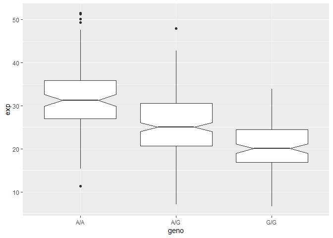
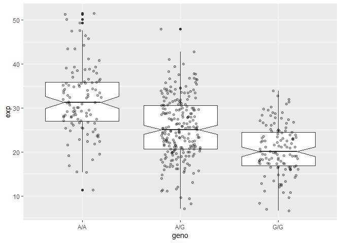

Class 11_genomics
================

> Q5: What proportion of the Mexican Ancestry in Los Angeles sample
> population (MXL) are homozygous for the asthma associated SNP (G\|G)?

``` r
genotype <- read.csv("sample_genotype.csv", row.names = 1)

table(genotype)
```

    , , Father = -, Mother = -

                             Population.s.
    Genotype..forward.strand. ALL, AMR, MXL
                          A|A            22
                          A|G            21
                          G|A            12
                          G|G             9

``` r
table(genotype$Genotype..forward.strand.)/nrow(genotype)
```


         A|A      A|G      G|A      G|G 
    0.343750 0.328125 0.187500 0.140625 

# PSA

> Q13: Read this file into R and determine the sample size for each
> genotype and their corresponding median expression levels for each of
> these genotypes.

``` r
count <- read.table("rs8067378_ENSG00000172057.6.txt", row.names = 1)
head(count)
```

       sample geno      exp
    1 HG00367  A/G 28.96038
    2 NA20768  A/G 20.24449
    3 HG00361  A/A 31.32628
    4 HG00135  A/A 34.11169
    5 NA18870  G/G 18.25141
    6 NA11993  A/A 32.89721

``` r
summary(count)
```

        sample              geno                exp        
     Length:462         Length:462         Min.   : 6.675  
     Class :character   Class :character   1st Qu.:20.004  
     Mode  :character   Mode  :character   Median :25.116  
                                           Mean   :25.640  
                                           3rd Qu.:30.779  
                                           Max.   :51.518  

``` r
table(count$geno)
```


    A/A A/G G/G 
    108 233 121 

``` r
inds <- count$geno == "G/G"
summary(count$exp[inds])
```

       Min. 1st Qu.  Median    Mean 3rd Qu.    Max. 
      6.675  16.903  20.074  20.594  24.457  33.956 

``` r
inds1 <- count$geno == "A/G"
summary(count$exp[inds1])
```

       Min. 1st Qu.  Median    Mean 3rd Qu.    Max. 
      7.075  20.626  25.065  25.397  30.552  48.034 

``` r
inds2 <- count$geno == "A/A"
summary(count$exp[inds2])
```

       Min. 1st Qu.  Median    Mean 3rd Qu.    Max. 
      11.40   27.02   31.25   31.82   35.92   51.52 

``` r
library(ggplot2)
```

``` r
head(count)
```

       sample geno      exp
    1 HG00367  A/G 28.96038
    2 NA20768  A/G 20.24449
    3 HG00361  A/A 31.32628
    4 HG00135  A/A 34.11169
    5 NA18870  G/G 18.25141
    6 NA11993  A/A 32.89721

``` r
ggplot(count) +
  aes(x = geno, y = exp) +
  geom_boxplot(notch = T)
```



if the notches doesnt overlap, theyre diff

``` r
ggplot(count) +
  aes(x = geno, y = exp) +
  geom_boxplot(notch = T) +
  geom_jitter(width = 0.2, alpha = 0.3)
```


