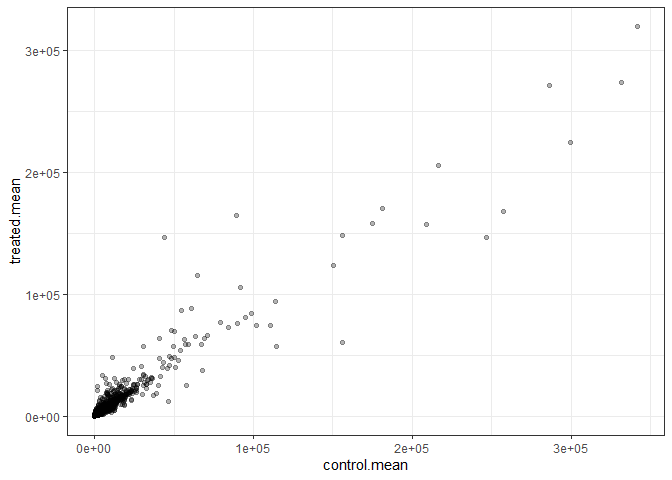
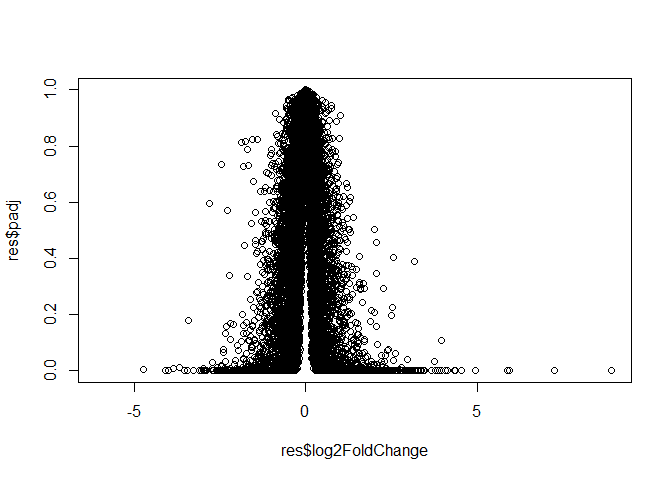
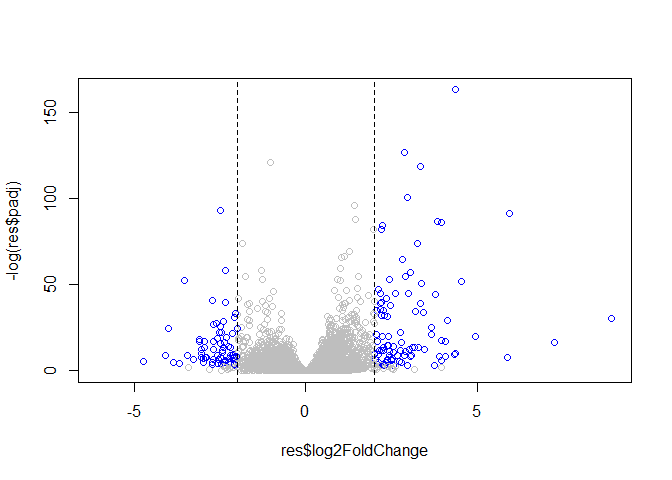

Class12: RNASeq pt1
================
Ashlyn Murphy

# Load the data

count data = number of reads coming from each gene for each sample

col data/ metadata = information about the samples & columns of the data

``` r
counts <- read.csv("airway_scaledcounts.csv", row.names=1)
metadata <-  read.csv("airway_metadata.csv")
```

``` r
head(counts)
```

                    SRR1039508 SRR1039509 SRR1039512 SRR1039513 SRR1039516
    ENSG00000000003        723        486        904        445       1170
    ENSG00000000005          0          0          0          0          0
    ENSG00000000419        467        523        616        371        582
    ENSG00000000457        347        258        364        237        318
    ENSG00000000460         96         81         73         66        118
    ENSG00000000938          0          0          1          0          2
                    SRR1039517 SRR1039520 SRR1039521
    ENSG00000000003       1097        806        604
    ENSG00000000005          0          0          0
    ENSG00000000419        781        417        509
    ENSG00000000457        447        330        324
    ENSG00000000460         94        102         74
    ENSG00000000938          0          0          0

``` r
metadata
```

              id     dex celltype     geo_id
    1 SRR1039508 control   N61311 GSM1275862
    2 SRR1039509 treated   N61311 GSM1275863
    3 SRR1039512 control  N052611 GSM1275866
    4 SRR1039513 treated  N052611 GSM1275867
    5 SRR1039516 control  N080611 GSM1275870
    6 SRR1039517 treated  N080611 GSM1275871
    7 SRR1039520 control  N061011 GSM1275874
    8 SRR1039521 treated  N061011 GSM1275875

check the metadata (i.e coldata) matches the order of the samples in
counts data

``` r
metadata$id
```

    [1] "SRR1039508" "SRR1039509" "SRR1039512" "SRR1039513" "SRR1039516"
    [6] "SRR1039517" "SRR1039520" "SRR1039521"

``` r
colnames(counts)
```

    [1] "SRR1039508" "SRR1039509" "SRR1039512" "SRR1039513" "SRR1039516"
    [6] "SRR1039517" "SRR1039520" "SRR1039521"

``` r
metadata$id == colnames(counts)
```

    [1] TRUE TRUE TRUE TRUE TRUE TRUE TRUE TRUE

can use the `all()` function to check if all the inputs are TRUE

``` r
c(T,T,T,T)
```

    [1] TRUE TRUE TRUE TRUE

``` r
all(c(T,T,T,T))
```

    [1] TRUE

``` r
all(c(T,T,F,T))
```

    [1] FALSE

``` r
all(metadata$id == colnames(counts))
```

    [1] TRUE

``` r
if(TRUE) {
  cat("WOW something is wrong")
}
```

    WOW something is wrong

``` r
if(all(c(T,T,F,T))){
  
}
```

``` r
if(!all(metadata$id == colnames(counts))) {
  cat("WOW something is wrong")
}
```

can also use stop or warning in place of cat

> Q1. How many genes are in this dataset?

``` r
nrow(counts)
```

    [1] 38694

> Q2. How many ‘control’ cell lines do we have?

``` r
sum(metadata$dex == "control")
```

    [1] 4

> Q3. How would you make the above code in either approach more robust?

extract control cells

``` r
control.id <- metadata[metadata$dex == "control",]$id
```

> Q4. Follow the same procedure for the treated samples (i.e. calculate
> the mean per gene across drug treated samples and assign to a labeled
> vector called treated.mean)

``` r
control.counts <- counts[,control.id]
head(control.counts)
```

                    SRR1039508 SRR1039512 SRR1039516 SRR1039520
    ENSG00000000003        723        904       1170        806
    ENSG00000000005          0          0          0          0
    ENSG00000000419        467        616        582        417
    ENSG00000000457        347        364        318        330
    ENSG00000000460         96         73        118        102
    ENSG00000000938          0          1          2          0

``` r
control.mean <- rowMeans(control.counts)
head(control.mean)
```

    ENSG00000000003 ENSG00000000005 ENSG00000000419 ENSG00000000457 ENSG00000000460 
             900.75            0.00          520.50          339.75           97.25 
    ENSG00000000938 
               0.75 

extract treated cells

``` r
control.treated <- metadata[metadata$dex == "treated",]$id

treated.counts <- counts[,control.treated]
head(control.treated)
```

    [1] "SRR1039509" "SRR1039513" "SRR1039517" "SRR1039521"

``` r
treated.mean <- rowMeans(treated.counts)
head(treated.mean)
```

    ENSG00000000003 ENSG00000000005 ENSG00000000419 ENSG00000000457 ENSG00000000460 
             658.00            0.00          546.00          316.50           78.75 
    ENSG00000000938 
               0.00 

reorganize for clarity & make a new dataframe called `meancounts`

``` r
mean.counts <- data.frame(control.mean, treated.mean)
head(mean.counts)
```

                    control.mean treated.mean
    ENSG00000000003       900.75       658.00
    ENSG00000000005         0.00         0.00
    ENSG00000000419       520.50       546.00
    ENSG00000000457       339.75       316.50
    ENSG00000000460        97.25        78.75
    ENSG00000000938         0.75         0.00

``` r
plot(mean.counts)
```


> Q5 (b).You could also use the ggplot2 package to make this figure
> producing the plot below. What geom\_?() function would you use for
> this plot?

``` r
library(ggplot2)
```

``` r
ggplot(mean.counts) +
  aes(control.mean, treated.mean) +
  geom_point(alpha = 0.3) +
  theme_bw()
```



data is very skewed, try log transform of both axis

> Q5 (a). Create a scatter plot showing the mean of the treated samples
> against the mean of the control samples. Your plot should look
> something like the following

``` r
plot(mean.counts)
```


> Q6. Try plotting both axes on a log scale. What is the argument to
> plot() that allows you to do this?

``` r
plot(mean.counts, log = "xy")
```

    Warning in xy.coords(x, y, xlabel, ylabel, log): 15032 x values <= 0 omitted
    from logarithmic plot

    Warning in xy.coords(x, y, xlabel, ylabel, log): 15281 y values <= 0 omitted
    from logarithmic plot


we usually use log2 units bc it shows log fold change that is easy to
follow (ex: log fold change of 2 means a 4 fold change) ((above +2 means
upregulated genes, below -2 means downregulated genes))

lets store log2 fold change values into a new column in mean counts

``` r
mean.counts$log2fc <- log2(mean.counts$treated.mean/mean.counts$control.mean)
```

``` r
head(mean.counts)
```

                    control.mean treated.mean      log2fc
    ENSG00000000003       900.75       658.00 -0.45303916
    ENSG00000000005         0.00         0.00         NaN
    ENSG00000000419       520.50       546.00  0.06900279
    ENSG00000000457       339.75       316.50 -0.10226805
    ENSG00000000460        97.25        78.75 -0.30441833
    ENSG00000000938         0.75         0.00        -Inf

will have to exclude genes with lacking data bc their log values are
messed up!

``` r
head(mean.counts[,1:2] == 0)
```

                    control.mean treated.mean
    ENSG00000000003        FALSE        FALSE
    ENSG00000000005         TRUE         TRUE
    ENSG00000000419        FALSE        FALSE
    ENSG00000000457        FALSE        FALSE
    ENSG00000000460        FALSE        FALSE
    ENSG00000000938        FALSE         TRUE

``` r
to.keep <- rowSums(mean.counts[,1:2] == 0) == 0

my.counts <- mean.counts[to.keep,]

nrow(my.counts)
```

    [1] 21817

> Q8. how many genes are upregulated (log2fc threshold of +2)

``` r
sum(my.counts$log2fc >= +2)
```

    [1] 314

> Q9. determine how many down regulated genes we have at the greater
> than 2 fc level?

how many genes are downregulated (log2fc threshold of -2)

``` r
sum(my.counts$log2fc <= -2)
```

    [1] 485

> Q10. Do you trust these results? Why or why not?

no bc no stat data

were missing statistical significance values! time to use `DESeq()`

# Use DESeq

`| message: false` flag stops the extra printout

``` r
library(DESeq2)
```

DESeq needs specific input

``` r
dds <- DESeqDataSetFromMatrix(countData = counts, colData = metadata, design = ~dex)
```

    converting counts to integer mode

    Warning in DESeqDataSet(se, design = design, ignoreRank): some variables in
    design formula are characters, converting to factors

``` r
dds <- DESeq(dds)
```

    estimating size factors

    estimating dispersions

    gene-wise dispersion estimates

    mean-dispersion relationship

    final dispersion estimates

    fitting model and testing

``` r
res <- results(dds)

head(res)
```

    log2 fold change (MLE): dex treated vs control 
    Wald test p-value: dex treated vs control 
    DataFrame with 6 rows and 6 columns
                      baseMean log2FoldChange     lfcSE      stat    pvalue
                     <numeric>      <numeric> <numeric> <numeric> <numeric>
    ENSG00000000003 747.194195     -0.3507030  0.168246 -2.084470 0.0371175
    ENSG00000000005   0.000000             NA        NA        NA        NA
    ENSG00000000419 520.134160      0.2061078  0.101059  2.039475 0.0414026
    ENSG00000000457 322.664844      0.0245269  0.145145  0.168982 0.8658106
    ENSG00000000460  87.682625     -0.1471420  0.257007 -0.572521 0.5669691
    ENSG00000000938   0.319167     -1.7322890  3.493601 -0.495846 0.6200029
                         padj
                    <numeric>
    ENSG00000000003  0.163035
    ENSG00000000005        NA
    ENSG00000000419  0.176032
    ENSG00000000457  0.961694
    ENSG00000000460  0.815849
    ENSG00000000938        NA

padj is adjusted pvalue (adjusted for multiple testing bias)

make a main summary figure

# Volcano plot

``` r
plot(res$log2FoldChange, res$padj)
```



needs a log transform to show the data we actually care about which is
alues with low padj

``` r
plot(res$log2FoldChange, log(res$padj))
```


flip axis to put it the way its normally seen which is -logPvalue

``` r
plot(res$log2FoldChange, -log(res$padj))
```


care abt the points that are “exploding” out

making it pretty

``` r
mycols <- rep("gray", nrow(res))

mycols[res$log2FoldChange >= +2] <- "blue"
  
mycols[res$log2FoldChange <= -2] <- "blue"
  
mycols[res$padj > 0.05] <- "gray"
  
plot(res$log2FoldChange, -log(res$padj), col = mycols)

abline(v=c(-2,+2), lty = 2)
```



We will use one of Bioconductor’s main annotation packages to help with
mapping between various ID schemes. Here we load the AnnotationDbi
package and the annotation data package for humans org.Hs.eg.db.

``` r
library("AnnotationDbi")
library("org.Hs.eg.db")
```

to get a list of all available key types that we can use to map between,
use the `columns()` function:

``` r
columns(org.Hs.eg.db)
```

     [1] "ACCNUM"       "ALIAS"        "ENSEMBL"      "ENSEMBLPROT"  "ENSEMBLTRANS"
     [6] "ENTREZID"     "ENZYME"       "EVIDENCE"     "EVIDENCEALL"  "GENENAME"    
    [11] "GENETYPE"     "GO"           "GOALL"        "IPI"          "MAP"         
    [16] "OMIM"         "ONTOLOGY"     "ONTOLOGYALL"  "PATH"         "PFAM"        
    [21] "PMID"         "PROSITE"      "REFSEQ"       "SYMBOL"       "UCSCKG"      
    [26] "UNIPROT"     

have to tell it what format the data we have is in, and what we want it
to be in

> Q11. Run the mapIds() function two more times to add the Entrez ID and
> UniProt accession and GENENAME as new columns called
> res$entrez, res$uniprot and res\$genename.

``` r
res$symbol <- mapIds(org.Hs.eg.db,
                     keys=row.names(res),      # Our genenames
                     keytype="ENSEMBL",        # The format of our genenames
                     column="SYMBOL",          # The new format we want to add
                     multiVals="first")        # take the first value in the database if there are multiple possible values for a single input value
```

    'select()' returned 1:many mapping between keys and columns

``` r
head(res)
```

    log2 fold change (MLE): dex treated vs control 
    Wald test p-value: dex treated vs control 
    DataFrame with 6 rows and 7 columns
                      baseMean log2FoldChange     lfcSE      stat    pvalue
                     <numeric>      <numeric> <numeric> <numeric> <numeric>
    ENSG00000000003 747.194195     -0.3507030  0.168246 -2.084470 0.0371175
    ENSG00000000005   0.000000             NA        NA        NA        NA
    ENSG00000000419 520.134160      0.2061078  0.101059  2.039475 0.0414026
    ENSG00000000457 322.664844      0.0245269  0.145145  0.168982 0.8658106
    ENSG00000000460  87.682625     -0.1471420  0.257007 -0.572521 0.5669691
    ENSG00000000938   0.319167     -1.7322890  3.493601 -0.495846 0.6200029
                         padj      symbol
                    <numeric> <character>
    ENSG00000000003  0.163035      TSPAN6
    ENSG00000000005        NA        TNMD
    ENSG00000000419  0.176032        DPM1
    ENSG00000000457  0.961694       SCYL3
    ENSG00000000460  0.815849    C1orf112
    ENSG00000000938        NA         FGR

``` r
res$entrez <- mapIds(org.Hs.eg.db,
                     keys=row.names(res), # Our genenames
                     keytype="ENSEMBL",        # The format of our genenames
                     column="ENTREZID",          # The new format we want to add
                     multiVals="first")
```

    'select()' returned 1:many mapping between keys and columns

``` r
res$genename <- mapIds(org.Hs.eg.db,
                     keys=row.names(res), # Our genenames
                     keytype="ENSEMBL",        # The format of our genenames
                     column="GENENAME",          # The new format we want to add
                     multiVals="first")
```

    'select()' returned 1:many mapping between keys and columns

``` r
head(res)
```

    log2 fold change (MLE): dex treated vs control 
    Wald test p-value: dex treated vs control 
    DataFrame with 6 rows and 9 columns
                      baseMean log2FoldChange     lfcSE      stat    pvalue
                     <numeric>      <numeric> <numeric> <numeric> <numeric>
    ENSG00000000003 747.194195     -0.3507030  0.168246 -2.084470 0.0371175
    ENSG00000000005   0.000000             NA        NA        NA        NA
    ENSG00000000419 520.134160      0.2061078  0.101059  2.039475 0.0414026
    ENSG00000000457 322.664844      0.0245269  0.145145  0.168982 0.8658106
    ENSG00000000460  87.682625     -0.1471420  0.257007 -0.572521 0.5669691
    ENSG00000000938   0.319167     -1.7322890  3.493601 -0.495846 0.6200029
                         padj      symbol      entrez               genename
                    <numeric> <character> <character>            <character>
    ENSG00000000003  0.163035      TSPAN6        7105          tetraspanin 6
    ENSG00000000005        NA        TNMD       64102            tenomodulin
    ENSG00000000419  0.176032        DPM1        8813 dolichyl-phosphate m..
    ENSG00000000457  0.961694       SCYL3       57147 SCY1 like pseudokina..
    ENSG00000000460  0.815849    C1orf112       55732 chromosome 1 open re..
    ENSG00000000938        NA         FGR        2268 FGR proto-oncogene, ..

``` r
res$uniprot <- mapIds(org.Hs.eg.db,
                     keys=row.names(res), # Our genenames
                     keytype="ENSEMBL",        # The format of our genenames
                     column="UNIPROT",          # The new format we want to add
                     multiVals="first")
```

    'select()' returned 1:many mapping between keys and columns

``` r
head(res)
```

    log2 fold change (MLE): dex treated vs control 
    Wald test p-value: dex treated vs control 
    DataFrame with 6 rows and 10 columns
                      baseMean log2FoldChange     lfcSE      stat    pvalue
                     <numeric>      <numeric> <numeric> <numeric> <numeric>
    ENSG00000000003 747.194195     -0.3507030  0.168246 -2.084470 0.0371175
    ENSG00000000005   0.000000             NA        NA        NA        NA
    ENSG00000000419 520.134160      0.2061078  0.101059  2.039475 0.0414026
    ENSG00000000457 322.664844      0.0245269  0.145145  0.168982 0.8658106
    ENSG00000000460  87.682625     -0.1471420  0.257007 -0.572521 0.5669691
    ENSG00000000938   0.319167     -1.7322890  3.493601 -0.495846 0.6200029
                         padj      symbol      entrez               genename
                    <numeric> <character> <character>            <character>
    ENSG00000000003  0.163035      TSPAN6        7105          tetraspanin 6
    ENSG00000000005        NA        TNMD       64102            tenomodulin
    ENSG00000000419  0.176032        DPM1        8813 dolichyl-phosphate m..
    ENSG00000000457  0.961694       SCYL3       57147 SCY1 like pseudokina..
    ENSG00000000460  0.815849    C1orf112       55732 chromosome 1 open re..
    ENSG00000000938        NA         FGR        2268 FGR proto-oncogene, ..
                        uniprot
                    <character>
    ENSG00000000003  A0A024RCI0
    ENSG00000000005      Q9H2S6
    ENSG00000000419      O60762
    ENSG00000000457      Q8IZE3
    ENSG00000000460  A0A024R922
    ENSG00000000938      P09769

arrange the resutls by the adjusted pvalue and then save the data for
next time

``` r
ord <- order( res$padj )
```

``` r
write.csv(res[ord,], "deseq_results.csv")
```

# pathway analysis

KEGG

add names to the foldchange vector

``` r
foldchange <- res$log2FoldChange

names(foldchange) <- res$entrez

head(foldchange)
```

           7105       64102        8813       57147       55732        2268 
    -0.35070302          NA  0.20610777  0.02452695 -0.14714205 -1.73228897 

``` r
library(pathview)
library(gage)
library(gageData)
```

``` r
data(kegg.sets.hs)

gs <- gage(foldchange, gsets = kegg.sets.hs)
```

``` r
attributes(gs)
```

    $names
    [1] "greater" "less"    "stats"  

``` r
head(gs$less, 3)
```

                                          p.geomean stat.mean        p.val
    hsa05332 Graft-versus-host disease 0.0004250461 -3.473346 0.0004250461
    hsa04940 Type I diabetes mellitus  0.0017820293 -3.002352 0.0017820293
    hsa05310 Asthma                    0.0020045888 -3.009050 0.0020045888
                                            q.val set.size         exp1
    hsa05332 Graft-versus-host disease 0.09053483       40 0.0004250461
    hsa04940 Type I diabetes mellitus  0.14232581       42 0.0017820293
    hsa05310 Asthma                    0.14232581       29 0.0020045888

``` r
pathview(gene.data=foldchange, pathway.id="hsa05310")
```

    'select()' returned 1:1 mapping between keys and columns

    Info: Working in directory C:/Users/ashly/OneDrive/BGGN213/bggn213_github/Class12

    Info: Writing image file hsa05310.pathview.png


GO

``` r
data(go.sets.hs)
data(go.subs.hs)
```
