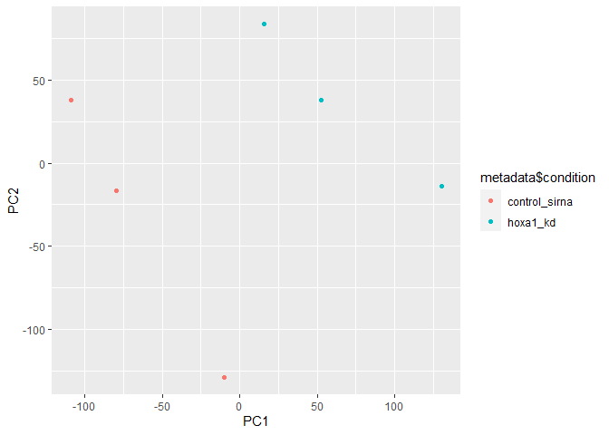
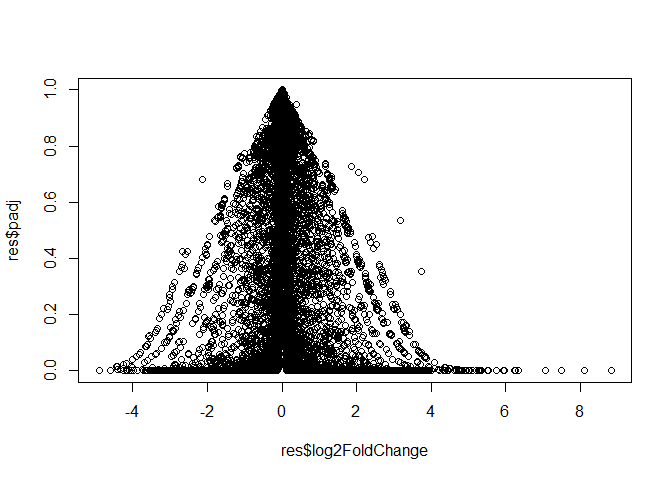
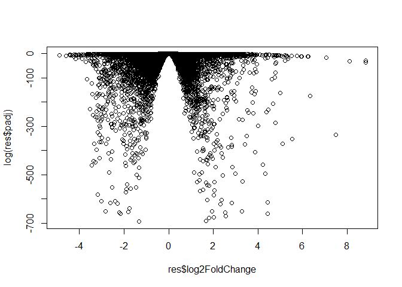
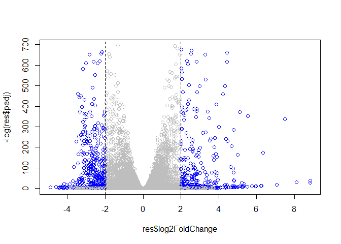

Class13: Mini-seq project
================
Ashlyn Murphy

# read in the countData and ColData

``` r
counts <- read.csv("GSE37704_featurecounts.csv", row.names = 1)

metadata <- read.csv("GSE37704_metadata.csv")
```

``` r
head(counts)
```

                    length SRR493366 SRR493367 SRR493368 SRR493369 SRR493370
    ENSG00000186092    918         0         0         0         0         0
    ENSG00000279928    718         0         0         0         0         0
    ENSG00000279457   1982        23        28        29        29        28
    ENSG00000278566    939         0         0         0         0         0
    ENSG00000273547    939         0         0         0         0         0
    ENSG00000187634   3214       124       123       205       207       212
                    SRR493371
    ENSG00000186092         0
    ENSG00000279928         0
    ENSG00000279457        46
    ENSG00000278566         0
    ENSG00000273547         0
    ENSG00000187634       258

``` r
head(metadata)
```

             id     condition
    1 SRR493366 control_sirna
    2 SRR493367 control_sirna
    3 SRR493368 control_sirna
    4 SRR493369      hoxa1_kd
    5 SRR493370      hoxa1_kd
    6 SRR493371      hoxa1_kd

> Q. Do they match?

No

``` r
countdata <- counts[,-1]
```

``` r
colnames(countdata) == metadata$id
```

    [1] TRUE TRUE TRUE TRUE TRUE TRUE

> Q. Remove zero count genes

``` r
to.keep <- rowSums(countdata) > 0

count <- countdata[to.keep,]
```

``` r
head(count)
```

                    SRR493366 SRR493367 SRR493368 SRR493369 SRR493370 SRR493371
    ENSG00000279457        23        28        29        29        28        46
    ENSG00000187634       124       123       205       207       212       258
    ENSG00000188976      1637      1831      2383      1226      1326      1504
    ENSG00000187961       120       153       180       236       255       357
    ENSG00000187583        24        48        65        44        48        64
    ENSG00000187642         4         9        16        14        16        16

``` r
nrow(count)
```

    [1] 15975

# PCA as quality control

base r function is `prcomp()` and uses `t()` transpose of data as input

> Q. How much variance is captrued in first 2 PC’s

``` r
pc <- prcomp(t(count), scale = T)
summary(pc)
```

    Importance of components:
                               PC1     PC2      PC3      PC4      PC5       PC6
    Standard deviation     87.7211 73.3196 32.89604 31.15094 29.18417 6.648e-13
    Proportion of Variance  0.4817  0.3365  0.06774  0.06074  0.05332 0.000e+00
    Cumulative Proportion   0.4817  0.8182  0.88594  0.94668  1.00000 1.000e+00

82%

plot of PC1 vs PC2

``` r
library(ggplot2)
```

``` r
x <- as.data.frame(pc$x)

x
```

                     PC1        PC2        PC3        PC4        PC5           PC6
    SRR493366 -109.25552   37.82004 -15.672855  -9.478082 -41.578831 -1.207945e-12
    SRR493367  -79.52470  -16.76884  -3.342885 -30.007959  44.778561 -1.432167e-15
    SRR493368  -10.21448 -128.65540   9.086014  30.145032  -7.226810  9.639088e-13
    SRR493369   15.64576   83.53988 -12.808025  46.849300  18.985338  3.863251e-13
    SRR493370   52.58209   37.98050  59.581067 -13.530217  -7.718522  5.743089e-13
    SRR493371  130.76685  -13.91619 -36.843317 -23.978074  -7.239737 -7.159919e-13

``` r
ggplot(x) +
  aes(PC1, PC2, group = metadata$condition, col = metadata$condition) +
  geom_point()
```



# DESeq Analysis

``` r
library(DESeq2)
```

``` r
dds <- DESeqDataSetFromMatrix(countData = count, colData = metadata, design = ~condition)
```

    Warning in DESeqDataSet(se, design = design, ignoreRank): some variables in
    design formula are characters, converting to factors

``` r
dds <- DESeq(dds)
```

    estimating size factors

    estimating dispersions

    gene-wise dispersion estimates

    mean-dispersion relationship

    final dispersion estimates

    fitting model and testing

``` r
res <- results(dds)

res
```

    log2 fold change (MLE): condition hoxa1 kd vs control sirna 
    Wald test p-value: condition hoxa1 kd vs control sirna 
    DataFrame with 15975 rows and 6 columns
                     baseMean log2FoldChange     lfcSE       stat      pvalue
                    <numeric>      <numeric> <numeric>  <numeric>   <numeric>
    ENSG00000279457   29.9136      0.1792571 0.3248216   0.551863 5.81042e-01
    ENSG00000187634  183.2296      0.4264571 0.1402658   3.040350 2.36304e-03
    ENSG00000188976 1651.1881     -0.6927205 0.0548465 -12.630158 1.43990e-36
    ENSG00000187961  209.6379      0.7297556 0.1318599   5.534326 3.12428e-08
    ENSG00000187583   47.2551      0.0405765 0.2718928   0.149237 8.81366e-01
    ...                   ...            ...       ...        ...         ...
    ENSG00000273748  35.30265       0.674387  0.303666   2.220817 2.63633e-02
    ENSG00000278817   2.42302      -0.388988  1.130394  -0.344117 7.30758e-01
    ENSG00000278384   1.10180       0.332991  1.660261   0.200565 8.41039e-01
    ENSG00000276345  73.64496      -0.356181  0.207716  -1.714752 8.63908e-02
    ENSG00000271254 181.59590      -0.609667  0.141320  -4.314071 1.60276e-05
                           padj
                      <numeric>
    ENSG00000279457 6.86555e-01
    ENSG00000187634 5.15718e-03
    ENSG00000188976 1.76549e-35
    ENSG00000187961 1.13413e-07
    ENSG00000187583 9.19031e-01
    ...                     ...
    ENSG00000273748 4.79091e-02
    ENSG00000278817 8.09772e-01
    ENSG00000278384 8.92654e-01
    ENSG00000276345 1.39762e-01
    ENSG00000271254 4.53648e-05

# Volcano / Summary Plot

``` r
plot(res$log2FoldChange, res$padj)
```



``` r
plot(res$log2FoldChange, log(res$padj))
```



``` r
plot(res$log2FoldChange, -log(res$padj))
```


``` r
mycols <- rep("gray", nrow(res))

mycols[res$log2FoldChange >= +2] <- "blue"

mycols[res$log2FoldChange <= -2] <- "blue"
  
mycols[res$padj > 0.05] <- "gray"

plot(res$log2FoldChange, -log(res$padj), col = mycols)
abline(v=c(-2,2), lty = 2)
```



# Annotations

KEGG

``` r
library("AnnotationDbi")
library("org.Hs.eg.db")
```

``` r
columns(org.Hs.eg.db)
```

     [1] "ACCNUM"       "ALIAS"        "ENSEMBL"      "ENSEMBLPROT"  "ENSEMBLTRANS"
     [6] "ENTREZID"     "ENZYME"       "EVIDENCE"     "EVIDENCEALL"  "GENENAME"    
    [11] "GENETYPE"     "GO"           "GOALL"        "IPI"          "MAP"         
    [16] "OMIM"         "ONTOLOGY"     "ONTOLOGYALL"  "PATH"         "PFAM"        
    [21] "PMID"         "PROSITE"      "REFSEQ"       "SYMBOL"       "UCSCKG"      
    [26] "UNIPROT"     

Add symbols to res

``` r
res$symbol <- mapIds(org.Hs.eg.db,
                     keys=row.names(res),     
                     keytype="ENSEMBL",        
                     column="SYMBOL",          
                     multiVals="first")        
```

    'select()' returned 1:many mapping between keys and columns

add entrez id’s to res

``` r
res$entrez <- mapIds(org.Hs.eg.db,
                     keys=row.names(res),     
                     keytype="ENSEMBL",        
                     column="ENTREZID",          
                     multiVals="first") 
```

    'select()' returned 1:many mapping between keys and columns

add gene names to res

``` r
res$genename <- mapIds(org.Hs.eg.db,
                     keys=row.names(res),     
                     keytype="ENSEMBL",        
                     column="GENENAME",          
                     multiVals="first") 
```

    'select()' returned 1:many mapping between keys and columns

``` r
head(res)
```

    log2 fold change (MLE): condition hoxa1 kd vs control sirna 
    Wald test p-value: condition hoxa1 kd vs control sirna 
    DataFrame with 6 rows and 9 columns
                     baseMean log2FoldChange     lfcSE       stat      pvalue
                    <numeric>      <numeric> <numeric>  <numeric>   <numeric>
    ENSG00000279457   29.9136      0.1792571 0.3248216   0.551863 5.81042e-01
    ENSG00000187634  183.2296      0.4264571 0.1402658   3.040350 2.36304e-03
    ENSG00000188976 1651.1881     -0.6927205 0.0548465 -12.630158 1.43990e-36
    ENSG00000187961  209.6379      0.7297556 0.1318599   5.534326 3.12428e-08
    ENSG00000187583   47.2551      0.0405765 0.2718928   0.149237 8.81366e-01
    ENSG00000187642   11.9798      0.5428105 0.5215598   1.040744 2.97994e-01
                           padj      symbol      entrez               genename
                      <numeric> <character> <character>            <character>
    ENSG00000279457 6.86555e-01          NA          NA                     NA
    ENSG00000187634 5.15718e-03      SAMD11      148398 sterile alpha motif ..
    ENSG00000188976 1.76549e-35       NOC2L       26155 NOC2 like nucleolar ..
    ENSG00000187961 1.13413e-07      KLHL17      339451 kelch like family me..
    ENSG00000187583 9.19031e-01     PLEKHN1       84069 pleckstrin homology ..
    ENSG00000187642 4.03379e-01       PERM1       84808 PPARGC1 and ESRR ind..

# Pathway Analysis

``` r
foldchange <- res$log2FoldChange

names(foldchange) <- res$entrez

head(foldchange)
```

           <NA>      148398       26155      339451       84069       84808 
     0.17925708  0.42645712 -0.69272046  0.72975561  0.04057653  0.54281049 

``` r
library(pathview)
library(gage)
library(gageData)
```

``` r
data(kegg.sets.hs)

gs <- gage(foldchange, gsets = kegg.sets.hs)
```

``` r
head(gs$less, 5)
```

                                                      p.geomean stat.mean
    hsa04110 Cell cycle                            8.995727e-06 -4.378644
    hsa03030 DNA replication                       9.424076e-05 -3.951803
    hsa05130 Pathogenic Escherichia coli infection 1.405864e-04 -3.765330
    hsa03013 RNA transport                         1.246882e-03 -3.059466
    hsa03440 Homologous recombination              3.066756e-03 -2.852899
                                                          p.val       q.val
    hsa04110 Cell cycle                            8.995727e-06 0.001889103
    hsa03030 DNA replication                       9.424076e-05 0.009841047
    hsa05130 Pathogenic Escherichia coli infection 1.405864e-04 0.009841047
    hsa03013 RNA transport                         1.246882e-03 0.065461279
    hsa03440 Homologous recombination              3.066756e-03 0.128803765
                                                   set.size         exp1
    hsa04110 Cell cycle                                 121 8.995727e-06
    hsa03030 DNA replication                             36 9.424076e-05
    hsa05130 Pathogenic Escherichia coli infection       53 1.405864e-04
    hsa03013 RNA transport                              144 1.246882e-03
    hsa03440 Homologous recombination                    28 3.066756e-03

``` r
pathview(gene.data=foldchange, pathway.id="hsa04110")
```

    'select()' returned 1:1 mapping between keys and columns

    Info: Working in directory C:/Users/ashly/OneDrive/BGGN213/bggn213_github/Class13

    Info: Writing image file hsa04110.pathview.png


GO

``` r
data(go.sets.hs)
data(go.subs.hs)
```

``` r
## Focus on Biological Process subset of GO
#gobpsets = go.sets.hs[go.subs.hs$BP]

#gobpres = gage(foldchanges, gsets=gobpsets, same.dir=TRUE)

#lapply(gobpres, head)
```
