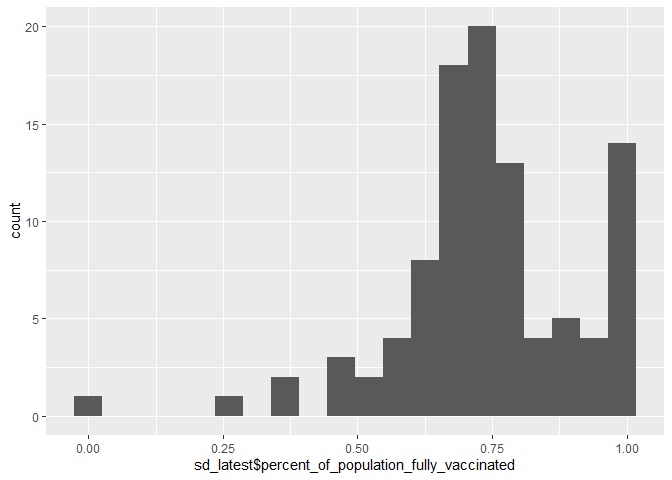
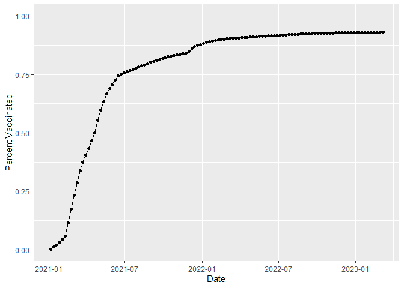
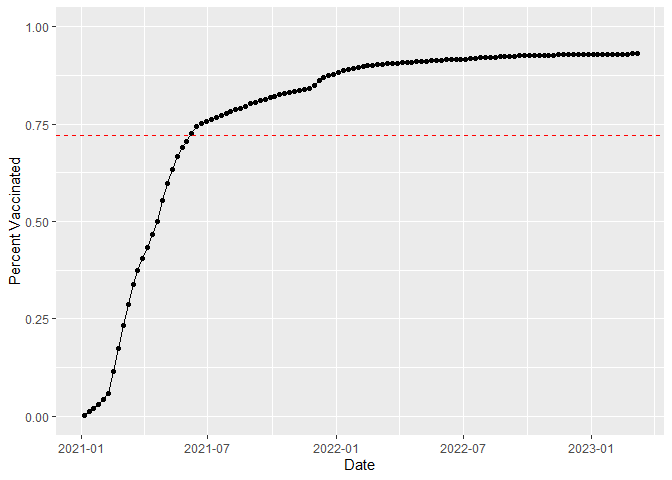
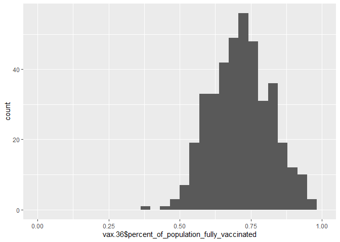
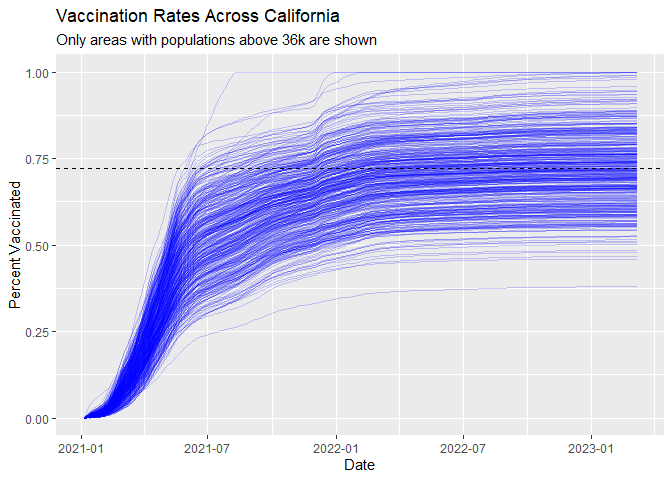

Class17: Vaccination Rate Mini Project
================
Ashlyn Murphy

# Background

Today’s class is exploratory data analysis on statewide vaccination
rates posted by CA.gov

The goal of this hands-on mini-project is to examine and compare the
Covid-19 vaccination rates around San Diego.

We will start by downloading the most recently dated “Statewide COVID-19
Vaccines Administered by ZIP Code” CSV file from:
https://data.ca.gov/dataset/covid-19-vaccine-progress-dashboard-data-by-zip-code

## Data Input

``` r
vax <- read.csv("covid19vaccinesbyzipcode_test.csv")

head(vax)
```

      as_of_date zip_code_tabulation_area local_health_jurisdiction          county
    1 2021-01-05                    93609                    Fresno          Fresno
    2 2021-01-05                    94086               Santa Clara     Santa Clara
    3 2021-01-05                    94304               Santa Clara     Santa Clara
    4 2021-01-05                    94110             San Francisco   San Francisco
    5 2021-01-05                    93420           San Luis Obispo San Luis Obispo
    6 2021-01-05                    93454             Santa Barbara   Santa Barbara
      vaccine_equity_metric_quartile                 vem_source
    1                              1 Healthy Places Index Score
    2                              4 Healthy Places Index Score
    3                              4 Healthy Places Index Score
    4                              4 Healthy Places Index Score
    5                              3 Healthy Places Index Score
    6                              2 Healthy Places Index Score
      age12_plus_population age5_plus_population tot_population
    1                4396.3                 4839           5177
    2               42696.0                46412          50477
    3                3263.5                 3576           3852
    4               64350.7                68320          72380
    5               26694.9                29253          30740
    6               32043.4                36446          40432
      persons_fully_vaccinated persons_partially_vaccinated
    1                       NA                           NA
    2                       11                          640
    3                       NA                           NA
    4                       18                         1262
    5                       NA                           NA
    6                       NA                           NA
      percent_of_population_fully_vaccinated
    1                                     NA
    2                               0.000218
    3                                     NA
    4                               0.000249
    5                                     NA
    6                                     NA
      percent_of_population_partially_vaccinated
    1                                         NA
    2                                   0.012679
    3                                         NA
    4                                   0.017436
    5                                         NA
    6                                         NA
      percent_of_population_with_1_plus_dose booster_recip_count
    1                                     NA                  NA
    2                               0.012897                  NA
    3                                     NA                  NA
    4                               0.017685                  NA
    5                                     NA                  NA
    6                                     NA                  NA
      bivalent_dose_recip_count eligible_recipient_count
    1                        NA                        1
    2                        NA                       11
    3                        NA                        6
    4                        NA                       18
    5                        NA                        4
    6                        NA                        5
                                                                   redacted
    1 Information redacted in accordance with CA state privacy requirements
    2 Information redacted in accordance with CA state privacy requirements
    3 Information redacted in accordance with CA state privacy requirements
    4 Information redacted in accordance with CA state privacy requirements
    5 Information redacted in accordance with CA state privacy requirements
    6 Information redacted in accordance with CA state privacy requirements

``` r
skimr::skim(vax)
```

|                                                  |        |
|:-------------------------------------------------|:-------|
| Name                                             | vax    |
| Number of rows                                   | 201096 |
| Number of columns                                | 18     |
| \_\_\_\_\_\_\_\_\_\_\_\_\_\_\_\_\_\_\_\_\_\_\_   |        |
| Column type frequency:                           |        |
| character                                        | 5      |
| numeric                                          | 13     |
| \_\_\_\_\_\_\_\_\_\_\_\_\_\_\_\_\_\_\_\_\_\_\_\_ |        |
| Group variables                                  | None   |

Data summary

**Variable type: character**

| skim_variable             | n_missing | complete_rate | min | max | empty | n_unique | whitespace |
|:--------------------------|----------:|--------------:|----:|----:|------:|---------:|-----------:|
| as_of_date                |         0 |             1 |  10 |  10 |     0 |      114 |          0 |
| local_health_jurisdiction |         0 |             1 |   0 |  15 |   570 |       62 |          0 |
| county                    |         0 |             1 |   0 |  15 |   570 |       59 |          0 |
| vem_source                |         0 |             1 |  15 |  26 |     0 |        3 |          0 |
| redacted                  |         0 |             1 |   2 |  69 |     0 |        2 |          0 |

**Variable type: numeric**

| skim_variable                              | n_missing | complete_rate |     mean |       sd |    p0 |      p25 |      p50 |      p75 |     p100 | hist  |
|:-------------------------------------------|----------:|--------------:|---------:|---------:|------:|---------:|---------:|---------:|---------:|:------|
| zip_code_tabulation_area                   |         0 |          1.00 | 93665.11 |  1817.38 | 90001 | 92257.75 | 93658.50 | 95380.50 |  97635.0 | ▃▅▅▇▁ |
| vaccine_equity_metric_quartile             |      9918 |          0.95 |     2.44 |     1.11 |     1 |     1.00 |     2.00 |     3.00 |      4.0 | ▇▇▁▇▇ |
| age12_plus_population                      |         0 |          1.00 | 18895.04 | 18993.87 |     0 |  1346.95 | 13685.10 | 31756.12 |  88556.7 | ▇▃▂▁▁ |
| age5_plus_population                       |         0 |          1.00 | 20875.24 | 21105.97 |     0 |  1460.50 | 15364.00 | 34877.00 | 101902.0 | ▇▃▂▁▁ |
| tot_population                             |      9804 |          0.95 | 23372.77 | 22628.50 |    12 |  2126.00 | 18714.00 | 38168.00 | 111165.0 | ▇▅▂▁▁ |
| persons_fully_vaccinated                   |     16621 |          0.92 | 13990.39 | 15073.66 |    11 |   932.00 |  8589.00 | 23346.00 |  87575.0 | ▇▃▁▁▁ |
| persons_partially_vaccinated               |     16621 |          0.92 |  1702.31 |  2033.32 |    11 |   165.00 |  1197.00 |  2536.00 |  39973.0 | ▇▁▁▁▁ |
| percent_of_population_fully_vaccinated     |     20965 |          0.90 |     0.57 |     0.25 |     0 |     0.42 |     0.61 |     0.74 |      1.0 | ▂▃▆▇▃ |
| percent_of_population_partially_vaccinated |     20965 |          0.90 |     0.08 |     0.09 |     0 |     0.05 |     0.06 |     0.08 |      1.0 | ▇▁▁▁▁ |
| percent_of_population_with_1\_plus_dose    |     22009 |          0.89 |     0.63 |     0.24 |     0 |     0.49 |     0.67 |     0.81 |      1.0 | ▂▂▅▇▆ |
| booster_recip_count                        |     72997 |          0.64 |  5882.76 |  7219.00 |    11 |   300.00 |  2773.00 |  9510.00 |  59593.0 | ▇▂▁▁▁ |
| bivalent_dose_recip_count                  |    158776 |          0.21 |  2978.23 |  3633.03 |    11 |   193.00 |  1467.50 |  4730.25 |  27694.0 | ▇▂▁▁▁ |
| eligible_recipient_count                   |         0 |          1.00 | 12830.83 | 14928.64 |     0 |   507.00 |  6369.00 | 22014.00 |  87248.0 | ▇▃▁▁▁ |

> Q1. What column details the total number of people fully vaccinated?

``` r
head(vax[10])
```

      persons_fully_vaccinated
    1                       NA
    2                       11
    3                       NA
    4                       18
    5                       NA
    6                       NA

column 10 details people fully vaccinated

> Q2. What column details the Zip code tabulation area?

``` r
head(vax[2])
```

      zip_code_tabulation_area
    1                    93609
    2                    94086
    3                    94304
    4                    94110
    5                    93420
    6                    93454

column 2 is the zip code tabulated area

> Q3. What is the earliest date in this dataset?

``` r
min(vax[]$as_of_date)
```

    [1] "2021-01-05"

the earliest date is 1/5/2021

> Q4. What is the latest date in this dataset?

``` r
max(vax[]$as_of_date)
```

    [1] "2023-03-07"

the last date is 3/07/2023

> Q5. How many numeric columns are in this dataset?

from the skimr package we can see there are 13 numeric columns

> Q6. Note that there are “missing values” in the dataset. How many NA
> values there in the persons_fully_vaccinated column?

from the skimr package we can see there are 16621 NA values in the
persons_fully_vaccinated or use the following code

``` r
total_vax <- sum(is.na(vax$persons_fully_vaccinated))
total_vax
```

    [1] 16621

> Q7. What percent of persons_fully_vaccinated values are missing (to 2
> significant figures)?

``` r
round((total_vax/nrow(vax))*100, 2)
```

    [1] 8.27

# Working with dates

use the `lubridate` package to help you work with times and dates

``` r
library(lubridate)
```


    Attaching package: 'lubridate'

    The following objects are masked from 'package:base':

        date, intersect, setdiff, union

``` r
today()
```

    [1] "2023-03-08"

``` r
#today() - vax$as_of_date[1]
```

^ doesnt work bc as_of_date column is actually in character strings
which cant be used for math

``` r
ymd("1999-4-14")
```

    [1] "1999-04-14"

``` r
today() - ymd("1999-4-14")
```

    Time difference of 8729 days

``` r
vax$as_of_date <- ymd(vax$as_of_date)
```

``` r
today() - vax$as_of_date[1]
```

    Time difference of 792 days

days since the first vaccination: 792

> Q9. How many days have passed since the last update of the dataset?

``` r
today() - vax$as_of_date[nrow(vax)]
```

    Time difference of 1 days

its been 1 day since it was last updated

> Q10. How many unique dates are in the dataset (i.e. how many different
> dates are detailed)?

``` r
length(unique(vax$as_of_date))
```

    [1] 114

or use a dplyr function

``` r
library(dplyr)
```


    Attaching package: 'dplyr'

    The following objects are masked from 'package:stats':

        filter, lag

    The following objects are masked from 'package:base':

        intersect, setdiff, setequal, union

``` r
n_distinct(vax$as_of_date)
```

    [1] 114

# Working with Zip codes

Many packages exist to work with zip codes, we will use `zipcodeR`

``` r
library(zipcodeR)
```

``` r
geocode_zip('92037')
```

    # A tibble: 1 × 3
      zipcode   lat   lng
      <chr>   <dbl> <dbl>
    1 92037    32.8 -117.

``` r
geocode_zip('48044')
```

    # A tibble: 1 × 3
      zipcode   lat   lng
      <chr>   <dbl> <dbl>
    1 48044    42.6 -82.9

``` r
zip_distance('92037','48044')
```

      zipcode_a zipcode_b distance
    1     92037     48044  1980.23

``` r
zip <- reverse_zipcode(c('92037', "48044") )

zip
```

    # A tibble: 2 × 24
      zipcode zipcode…¹ major…² post_…³ common_c…⁴ county state   lat    lng timez…⁵
      <chr>   <chr>     <chr>   <chr>       <blob> <chr>  <chr> <dbl>  <dbl> <chr>  
    1 92037   Standard  La Jol… La Jol… <raw 20 B> San D… CA     32.8 -117.  Pacific
    2 48044   Standard  Macomb  Macomb… <raw 18 B> Macom… MI     42.6  -82.9 Eastern
    # … with 14 more variables: radius_in_miles <dbl>, area_code_list <blob>,
    #   population <int>, population_density <dbl>, land_area_in_sqmi <dbl>,
    #   water_area_in_sqmi <dbl>, housing_units <int>,
    #   occupied_housing_units <int>, median_home_value <int>,
    #   median_household_income <int>, bounds_west <dbl>, bounds_east <dbl>,
    #   bounds_north <dbl>, bounds_south <dbl>, and abbreviated variable names
    #   ¹​zipcode_type, ²​major_city, ³​post_office_city, ⁴​common_city_list, …

find the best ratio of median household income in San Diego

first find all san diego zip codes

> Q11. How many distinct zip codes are listed for San Diego County?

``` r
sd.zip <- unique(vax$zip_code_tabulation_area[vax$county == "San Diego"])
```

``` r
length(sd.zip)
```

    [1] 107

107 distinct zips in SD county

now do a zip code look up for the data we want

``` r
sd.eco <- reverse_zipcode(sd.zip)

sd.eco
```

    # A tibble: 107 × 24
       zipcode zipcode…¹ major…² post_…³ common_c…⁴ county state   lat   lng timez…⁵
       <chr>   <chr>     <chr>   <chr>       <blob> <chr>  <chr> <dbl> <dbl> <chr>  
     1 91901   Standard  Alpine  Alpine… <raw 18 B> San D… CA     32.8 -117. Pacific
     2 91902   Standard  Bonita  Bonita… <raw 18 B> San D… CA     32.7 -117. Pacific
     3 91905   Standard  Boulev… Boulev… <raw 21 B> San D… CA     32.7 -116. Pacific
     4 91906   Standard  Campo   Campo,… <raw 17 B> San D… CA     32.7 -116. Pacific
     5 91910   Standard  Chula … Chula … <raw 23 B> San D… CA     32.6 -117. Pacific
     6 91911   Standard  Chula … Chula … <raw 23 B> San D… CA     32.6 -117. Pacific
     7 91913   Standard  Chula … Chula … <raw 23 B> San D… CA     32.6 -117. Pacific
     8 91914   Standard  Chula … Chula … <raw 23 B> San D… CA     32.7 -117. Pacific
     9 91915   Standard  Chula … Chula … <raw 23 B> San D… CA     32.6 -117. Pacific
    10 91916   Standard  Descan… Descan… <raw 20 B> San D… CA     32.9 -117. Pacific
    # … with 97 more rows, 14 more variables: radius_in_miles <dbl>,
    #   area_code_list <blob>, population <int>, population_density <dbl>,
    #   land_area_in_sqmi <dbl>, water_area_in_sqmi <dbl>, housing_units <int>,
    #   occupied_housing_units <int>, median_home_value <int>,
    #   median_household_income <int>, bounds_west <dbl>, bounds_east <dbl>,
    #   bounds_north <dbl>, bounds_south <dbl>, and abbreviated variable names
    #   ¹​zipcode_type, ²​major_city, ³​post_office_city, ⁴​common_city_list, …

and extract the values we want, which is the median_household_income and
median_home_value

most expensive area:

``` r
sd.eco$median_household_income
```

      [1]  79792  86981  70264  46875  54056  48111  84299 103393  94665  53843
     [11]  64926  24426  49268  41607  86406  69678  51694  51542     NA  37987
     [21]  73333  38563  59849  69601     NA  69821  40539  99412  63449 100100
     [31]  90417  96153 114880  72206  46856  49521  90960  45983  55839  52242
     [41]  61067  71628  65869  99367  64044  49534  60313  64033  64004  49521
     [51]  55938     NA  53167  93750  76273  37143 125051  51158  50750  71100
     [61]  87701  54441  54448  81835  46580  47559  38021 131406  52550  40557
     [71]  62092  47947  37534  82075  60929  63098  64478  59719  57350  27675
     [81]  56310  41866  53448  64026  91103  67616  81000 104063  65871  71412
     [91]  80463  81505 120106  92531 107870 127968 124099     NA     NA     NA
    [101]  58079     NA 226875     NA  57618     NA  36621

``` r
ord <- order(sd.eco$median_home_value, decreasing = T)

head(sd.eco[ord,])
```

    # A tibble: 6 × 24
      zipcode zipcode_…¹ major…² post_…³ common_c…⁴ county state   lat   lng timez…⁵
      <chr>   <chr>      <chr>   <chr>       <blob> <chr>  <chr> <dbl> <dbl> <chr>  
    1 92014   Standard   Del Mar Del Ma… <raw 19 B> San D… CA     33.0 -117. Pacific
    2 92037   Standard   La Jol… La Jol… <raw 20 B> San D… CA     32.8 -117. Pacific
    3 92067   PO Box     Rancho… Rancho… <raw 33 B> San D… CA     33.0 -117. Pacific
    4 92118   Standard   Corona… Corona… <raw 33 B> San D… CA     32.6 -117. Pacific
    5 92145   Unique     San Di… San Di… <raw 21 B> San D… CA     32.9 -117. Pacific
    6 92091   Standard   Rancho… Rancho… <raw 33 B> San D… CA     33   -117. Pacific
    # … with 14 more variables: radius_in_miles <dbl>, area_code_list <blob>,
    #   population <int>, population_density <dbl>, land_area_in_sqmi <dbl>,
    #   water_area_in_sqmi <dbl>, housing_units <int>,
    #   occupied_housing_units <int>, median_home_value <int>,
    #   median_household_income <int>, bounds_west <dbl>, bounds_east <dbl>,
    #   bounds_north <dbl>, bounds_south <dbl>, and abbreviated variable names
    #   ¹​zipcode_type, ²​major_city, ³​post_office_city, ⁴​common_city_list, …

``` r
arrange(sd.eco, desc(median_home_value))
```

    # A tibble: 107 × 24
       zipcode zipcode…¹ major…² post_…³ common_c…⁴ county state   lat   lng timez…⁵
       <chr>   <chr>     <chr>   <chr>       <blob> <chr>  <chr> <dbl> <dbl> <chr>  
     1 92014   Standard  Del Mar Del Ma… <raw 19 B> San D… CA     33.0 -117. Pacific
     2 92037   Standard  La Jol… La Jol… <raw 20 B> San D… CA     32.8 -117. Pacific
     3 92067   PO Box    Rancho… Rancho… <raw 33 B> San D… CA     33.0 -117. Pacific
     4 92118   Standard  Corona… Corona… <raw 33 B> San D… CA     32.6 -117. Pacific
     5 92145   Unique    San Di… San Di… <raw 21 B> San D… CA     32.9 -117. Pacific
     6 92091   Standard  Rancho… Rancho… <raw 33 B> San D… CA     33   -117. Pacific
     7 92075   Standard  Solana… Solana… <raw 24 B> San D… CA     33.0 -117. Pacific
     8 92106   Standard  San Di… San Di… <raw 21 B> San D… CA     32.7 -117. Pacific
     9 92130   Standard  San Di… San Di… <raw 21 B> San D… CA     33.0 -117. Pacific
    10 92007   Standard  Cardif… Cardif… <raw 35 B> San D… CA     33.0 -117. Pacific
    # … with 97 more rows, 14 more variables: radius_in_miles <dbl>,
    #   area_code_list <blob>, population <int>, population_density <dbl>,
    #   land_area_in_sqmi <dbl>, water_area_in_sqmi <dbl>, housing_units <int>,
    #   occupied_housing_units <int>, median_home_value <int>,
    #   median_household_income <int>, bounds_west <dbl>, bounds_east <dbl>,
    #   bounds_north <dbl>, bounds_south <dbl>, and abbreviated variable names
    #   ¹​zipcode_type, ²​major_city, ³​post_office_city, ⁴​common_city_list, …

least expensive

``` r
arrange(sd.eco, median_home_value)
```

    # A tibble: 107 × 24
       zipcode zipcode…¹ major…² post_…³ common_c…⁴ county state   lat   lng timez…⁵
       <chr>   <chr>     <chr>   <chr>       <blob> <chr>  <chr> <dbl> <dbl> <chr>  
     1 91931   PO Box    Guatay  Guatay… <raw 18 B> San D… CA     32.8 -117. Pacific
     2 91963   Standard  Potrero Potrer… <raw 19 B> San D… CA     32.6 -117. Pacific
     3 91934   Standard  Jacumba Jacumb… <raw 19 B> San D… CA     32.6 -116. Pacific
     4 92086   Standard  Warner… Warner… <raw 31 B> San D… CA     33.3 -117. Pacific
     5 91917   Standard  Dulzura Dulzur… <raw 19 B> San D… CA     32.7 -117. Pacific
     6 91906   Standard  Campo   Campo,… <raw 17 B> San D… CA     32.7 -116. Pacific
     7 92004   Standard  Borreg… Borreg… <raw 32 B> San D… CA     33.1 -116. Pacific
     8 92113   Standard  San Di… San Di… <raw 21 B> San D… CA     32.7 -117. Pacific
     9 92173   Standard  San Ys… San Ys… <raw 31 B> San D… CA     32.6 -117. Pacific
    10 91916   Standard  Descan… Descan… <raw 20 B> San D… CA     32.9 -117. Pacific
    # … with 97 more rows, 14 more variables: radius_in_miles <dbl>,
    #   area_code_list <blob>, population <int>, population_density <dbl>,
    #   land_area_in_sqmi <dbl>, water_area_in_sqmi <dbl>, housing_units <int>,
    #   occupied_housing_units <int>, median_home_value <int>,
    #   median_household_income <int>, bounds_west <dbl>, bounds_east <dbl>,
    #   bounds_north <dbl>, bounds_south <dbl>, and abbreviated variable names
    #   ¹​zipcode_type, ²​major_city, ³​post_office_city, ⁴​common_city_list, …

using dplyr…

``` r
sd <- filter(vax, county == "San Diego")

nrow(sd)
```

    [1] 12198

``` r
sd.10 <- filter(vax, county == "San Diego" &
                age5_plus_population > 10000)

nrow(sd.10)
```

    [1] 8664

> Q12. What San Diego County Zip code area has the largest 12 +
> Population in this dataset?

``` r
ind <- which.max(sd$age12_plus_population)
sd[ind,]
```

       as_of_date zip_code_tabulation_area local_health_jurisdiction    county
    67 2021-01-05                    92154                 San Diego San Diego
       vaccine_equity_metric_quartile                 vem_source
    67                              2 Healthy Places Index Score
       age12_plus_population age5_plus_population tot_population
    67               76365.2                82971          88979
       persons_fully_vaccinated persons_partially_vaccinated
    67                       16                         1400
       percent_of_population_fully_vaccinated
    67                                0.00018
       percent_of_population_partially_vaccinated
    67                                   0.015734
       percent_of_population_with_1_plus_dose booster_recip_count
    67                               0.015914                  NA
       bivalent_dose_recip_count eligible_recipient_count
    67                        NA                       16
                                                                    redacted
    67 Information redacted in accordance with CA state privacy requirements

> Q13. What is the overall average “Percent of Population Fully
> Vaccinated” value for all San Diego “County” as of “2023-03-07”?

``` r
sd_latest<- filter(sd, as_of_date == "2023-03-07")

head(sd_latest)
```

      as_of_date zip_code_tabulation_area local_health_jurisdiction    county
    1 2023-03-07                    92124                 San Diego San Diego
    2 2023-03-07                    92026                 San Diego San Diego
    3 2023-03-07                    91910                 San Diego San Diego
    4 2023-03-07                    91978                 San Diego San Diego
    5 2023-03-07                    92114                 San Diego San Diego
    6 2023-03-07                    91962                 San Diego San Diego
      vaccine_equity_metric_quartile                 vem_source
    1                              3 Healthy Places Index Score
    2                              2 Healthy Places Index Score
    3                              2 Healthy Places Index Score
    4                              2 Healthy Places Index Score
    5                              2 Healthy Places Index Score
    6                              3 Healthy Places Index Score
      age12_plus_population age5_plus_population tot_population
    1               25422.4                29040          32600
    2               42613.9                46283          50321
    3               64013.6                70086          74855
    4                8644.9                 9663          10506
    5               59050.7                64945          68851
    6                1758.7                 2020           2106
      persons_fully_vaccinated persons_partially_vaccinated
    1                    18864                         2490
    2                    35817                         3010
    3                    74079                        16143
    4                     7007                          703
    5                    50624                         5337
    6                     1031                           61
      percent_of_population_fully_vaccinated
    1                               0.578650
    2                               0.711770
    3                               0.989633
    4                               0.666952
    5                               0.735269
    6                               0.489554
      percent_of_population_partially_vaccinated
    1                                   0.076380
    2                                   0.059816
    3                                   0.215657
    4                                   0.066914
    5                                   0.077515
    6                                   0.028965
      percent_of_population_with_1_plus_dose booster_recip_count
    1                               0.655030               12151
    2                               0.771586               21320
    3                               1.000000               43124
    4                               0.733866                3981
    5                               0.812784               30156
    6                               0.518519                 593
      bivalent_dose_recip_count eligible_recipient_count redacted
    1                      5632                    18702       No
    2                      7776                    35716       No
    3                     13760                    73816       No
    4                      1284                     6988       No
    5                      9497                    50449       No
    6                       222                     1028       No

``` r
mean(sd_latest$percent_of_population_fully_vaccinated, na.rm = T)
```

    [1] 0.7402567

> Q14. Using either ggplot or base R graphics make a summary figure that
> shows the distribution of Percent of Population Fully Vaccinated
> values as of “2023-03-07”?

``` r
library(ggplot2)
```

``` r
ggplot(sd_latest) +
  aes(sd_latest$percent_of_population_fully_vaccinated) +
  geom_histogram(bins = 20)
```

    Warning: Use of `sd_latest$percent_of_population_fully_vaccinated` is discouraged.
    ℹ Use `percent_of_population_fully_vaccinated` instead.

    Warning: Removed 8 rows containing non-finite values (`stat_bin()`).



\#UCSD/La Jolla Area

``` r
ucsd <- filter(sd, zip_code_tabulation_area=="92037")
ucsd[1,]$age5_plus_population
```

    [1] 36144

> Q15. Using ggplot make a graph of the vaccination rate time course for
> the 92037 ZIP code area:

``` r
ljplot <- ggplot(ucsd) +
  aes(ucsd$as_of_date, ucsd$percent_of_population_fully_vaccinated) +
  geom_point() +
  geom_line(group = 1) +
  ylim(c(0,1)) +
  labs(x = "Date", y = "Percent Vaccinated")

ljplot
```

    Warning: Use of `ucsd$as_of_date` is discouraged.
    ℹ Use `as_of_date` instead.

    Warning: Use of `ucsd$percent_of_population_fully_vaccinated` is discouraged.
    ℹ Use `percent_of_population_fully_vaccinated` instead.

    Warning: Use of `ucsd$as_of_date` is discouraged.
    ℹ Use `as_of_date` instead.

    Warning: Use of `ucsd$percent_of_population_fully_vaccinated` is discouraged.
    ℹ Use `percent_of_population_fully_vaccinated` instead.



> Q16. Calculate the mean “Percent of Population Fully Vaccinated” for
> ZIP code areas with a population as large as 92037 (La Jolla)
> as_of_date “2023-02-28”. Add this as a straight horizontal line to
> your plot from above with the geom_hline() function?

``` r
vax.36 <- filter(vax, age5_plus_population > 36144 &
                as_of_date == "2023-03-07")

head(vax.36)
```

      as_of_date zip_code_tabulation_area local_health_jurisdiction         county
    1 2023-03-07                    94116             San Francisco  San Francisco
    2 2023-03-07                    92703                    Orange         Orange
    3 2023-03-07                    94118             San Francisco  San Francisco
    4 2023-03-07                    92376            San Bernardino San Bernardino
    5 2023-03-07                    92692                    Orange         Orange
    6 2023-03-07                    95148               Santa Clara    Santa Clara
      vaccine_equity_metric_quartile                 vem_source
    1                              4 Healthy Places Index Score
    2                              1 Healthy Places Index Score
    3                              4 Healthy Places Index Score
    4                              1 Healthy Places Index Score
    5                              4 Healthy Places Index Score
    6                              4 Healthy Places Index Score
      age12_plus_population age5_plus_population tot_population
    1               42334.3                45160          47346
    2               57182.7                64387          69112
    3               37628.5                40012          42095
    4               70232.1                79686          86085
    5               41008.9                44243          46800
    6               42163.3                46202          48273
      persons_fully_vaccinated persons_partially_vaccinated
    1                    41255                         2450
    2                    57887                         7399
    3                    33284                         3040
    4                    51367                         5674
    5                    35117                         2603
    6                    42298                         2684
      percent_of_population_fully_vaccinated
    1                               0.871351
    2                               0.837582
    3                               0.790688
    4                               0.596701
    5                               0.750363
    6                               0.876225
      percent_of_population_partially_vaccinated
    1                                   0.051747
    2                                   0.107058
    3                                   0.072218
    4                                   0.065912
    5                                   0.055620
    6                                   0.055600
      percent_of_population_with_1_plus_dose booster_recip_count
    1                               0.923098               34108
    2                               0.944640               28297
    3                               0.862906               27401
    4                               0.662613               23832
    5                               0.805983               23695
    6                               0.931825               31583
      bivalent_dose_recip_count eligible_recipient_count redacted
    1                     19158                    41000       No
    2                      7627                    57775       No
    3                     15251                    33146       No
    4                      6393                    51276       No
    5                     10169                    35031       No
    6                     12604                    42120       No

First figure out how many areas are at least as big as LJ & calc the
percent

``` r
avg.36 <- mean(vax.36$percent_of_population_fully_vaccinated, na.rm = T)

avg.36
```

    [1] 0.7214936

``` r
ljplot + geom_hline(yintercept = avg.36, col = "red", linetype = 2)
```

    Warning: Use of `ucsd$as_of_date` is discouraged.
    ℹ Use `as_of_date` instead.

    Warning: Use of `ucsd$percent_of_population_fully_vaccinated` is discouraged.
    ℹ Use `percent_of_population_fully_vaccinated` instead.

    Warning: Use of `ucsd$as_of_date` is discouraged.
    ℹ Use `as_of_date` instead.

    Warning: Use of `ucsd$percent_of_population_fully_vaccinated` is discouraged.
    ℹ Use `percent_of_population_fully_vaccinated` instead.



> Q17. What is the 6 number summary (Min, 1st Qu., Median, Mean, 3rd
> Qu., and Max) of the “Percent of Population Fully Vaccinated” values
> for ZIP code areas with a population as large as 92037 (La Jolla)
> as_of_date “2023-02-28”?

``` r
summary(vax.36)
```

       as_of_date         zip_code_tabulation_area local_health_jurisdiction
     Min.   :2023-03-07   Min.   :90001            Length:411               
     1st Qu.:2023-03-07   1st Qu.:91762            Class :character         
     Median :2023-03-07   Median :92646            Mode  :character         
     Mean   :2023-03-07   Mean   :92862                                     
     3rd Qu.:2023-03-07   3rd Qu.:94517                                     
     Max.   :2023-03-07   Max.   :96003                                     
        county          vaccine_equity_metric_quartile  vem_source       
     Length:411         Min.   :1.000                  Length:411        
     Class :character   1st Qu.:1.000                  Class :character  
     Mode  :character   Median :2.000                  Mode  :character  
                        Mean   :2.353                                    
                        3rd Qu.:3.000                                    
                        Max.   :4.000                                    
     age12_plus_population age5_plus_population tot_population  
     Min.   :31651         Min.   : 36181       Min.   : 38007  
     1st Qu.:37694         1st Qu.: 41613       1st Qu.: 44393  
     Median :43985         Median : 48573       Median : 52212  
     Mean   :46847         Mean   : 52012       Mean   : 55641  
     3rd Qu.:53932         3rd Qu.: 59168       3rd Qu.: 62910  
     Max.   :88557         Max.   :101902       Max.   :111165  
     persons_fully_vaccinated persons_partially_vaccinated
     Min.   :17515            Min.   : 1798               
     1st Qu.:32173            1st Qu.: 2930               
     Median :37245            Median : 3606               
     Mean   :40065            Mean   : 4216               
     3rd Qu.:45336            3rd Qu.: 4808               
     Max.   :87575            Max.   :39973               
     percent_of_population_fully_vaccinated
     Min.   :0.3805                        
     1st Qu.:0.6459                        
     Median :0.7183                        
     Mean   :0.7215                        
     3rd Qu.:0.7908                        
     Max.   :1.0000                        
     percent_of_population_partially_vaccinated
     Min.   :0.04365                           
     1st Qu.:0.05890                           
     Median :0.06688                           
     Mean   :0.07578                           
     3rd Qu.:0.07910                           
     Max.   :0.99773                           
     percent_of_population_with_1_plus_dose booster_recip_count
     Min.   :0.4448                         Min.   : 9036      
     1st Qu.:0.7132                         1st Qu.:17924      
     Median :0.7895                         Median :22651      
     Mean   :0.7909                         Mean   :23951      
     3rd Qu.:0.8688                         3rd Qu.:28637      
     Max.   :1.0000                         Max.   :59593      
     bivalent_dose_recip_count eligible_recipient_count   redacted        
     Min.   : 2733             Min.   :17436            Length:411        
     1st Qu.: 5910             1st Qu.:32080            Class :character  
     Median : 8109             Median :37158            Mode  :character  
     Mean   : 9164             Mean   :39928                              
     3rd Qu.:11504             3rd Qu.:45186                              
     Max.   :27694             Max.   :87248                              

> Q18. Using ggplot generate a histogram of this data.

``` r
ggplot(vax.36) +
  aes(vax.36$percent_of_population_fully_vaccinated ) +
  geom_histogram() +
  xlim(0,1.00)
```

    Warning: Use of `vax.36$percent_of_population_fully_vaccinated` is discouraged.
    ℹ Use `percent_of_population_fully_vaccinated` instead.

    `stat_bin()` using `bins = 30`. Pick better value with `binwidth`.

    Warning: Removed 2 rows containing missing values (`geom_bar()`).



``` r
vax %>% filter(as_of_date == "2023-03-07") %>%  
  filter(zip_code_tabulation_area=="92040") %>%
  select(percent_of_population_fully_vaccinated)
```

      percent_of_population_fully_vaccinated
    1                               0.550533

> Q19. Is the 92109 and 92040 ZIP code areas above or below the average
> value you calculated for all these above?

``` r
filter(vax.36, zip_code_tabulation_area %in% c("92109", "92040"))
```

      as_of_date zip_code_tabulation_area local_health_jurisdiction    county
    1 2023-03-07                    92109                 San Diego San Diego
    2 2023-03-07                    92040                 San Diego San Diego
      vaccine_equity_metric_quartile                 vem_source
    1                              3 Healthy Places Index Score
    2                              3 Healthy Places Index Score
      age12_plus_population age5_plus_population tot_population
    1               43222.5                44953          47111
    2               39405.0                42833          46306
      persons_fully_vaccinated persons_partially_vaccinated
    1                    32725                         4234
    2                    25493                         2156
      percent_of_population_fully_vaccinated
    1                               0.694636
    2                               0.550533
      percent_of_population_partially_vaccinated
    1                                   0.089873
    2                                   0.046560
      percent_of_population_with_1_plus_dose booster_recip_count
    1                               0.784509               19677
    2                               0.597093               14175
      bivalent_dose_recip_count eligible_recipient_count redacted
    1                      8109                    32622       No
    2                      4649                    25433       No

``` r
vax.36.all <- filter(vax, age5_plus_population > 36144)

ggplot(vax.36.all) +
  aes(x = as_of_date, y = percent_of_population_fully_vaccinated, group = zip_code_tabulation_area) +
  geom_line(alpha = 0.2, color = "blue") +
  ylim(0.00,1.00) +
  labs(x="Date", y = "Percent Vaccinated", title="Vaccination Rates Across California", subtitle ="Only areas with populations above 36k are shown") +
  geom_hline(yintercept = avg.36, linetype =2 )
```

    Warning: Removed 183 rows containing missing values (`geom_line()`).


