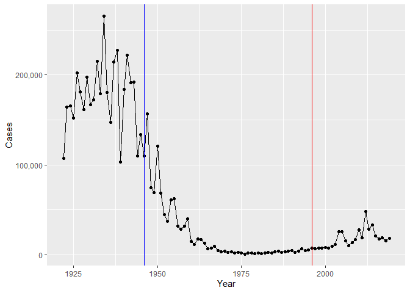

Class 19: Investigating pertussis resurgence Mini Project
================

# Web Scrpping

Here I extract the CDC figures for pertussis in the US
https://www.cdc.gov/pertussis/surv-reporting/cases-by-year.html

lets make a plot of the number of cases of pertussis per year

``` r
library(ggplot2)
```

``` r
base <- ggplot(cdc) +
  aes(Year, Cases) +
  geom_point() +
  geom_line() +
  scale_y_continuous(labels = scales::label_comma())

base
```


the first vaccine (WP) was introduced in 1946, lets add this as a line
to the plot

``` r
base + geom_vline(xintercept = 1946, col = "blue")
```


in 1996 the switch to the AP vaccine occurred, lets add this to our plot
as a red line

``` r
base + geom_vline(xintercept = 1946, col = "blue") + geom_vline(xintercept = 1996, col = "red" )
```



# Exploring CBI-PB data

Why is this vaccine-preventable disease on the upswing? To answer this
question we need to investigate the mechanisms underlying waning
protection against pertussis. This requires evaluation of
pertussis-specific immune responses over time in wP and aP vaccinated
individuals.

The new and ongoing CMI-PB project aims to provide the scientific
community with this very information.

The CMI-PB API (like most APIs) sends responses in JSON format. We will
use **jsonlite**

``` r
library(jsonlite)
```

``` r
subject <- read_json("http://cmi-pb.org/api/subject", simplifyVector = TRUE)

head(subject)
```

      subject_id infancy_vac biological_sex              ethnicity  race
    1          1          wP         Female Not Hispanic or Latino White
    2          2          wP         Female Not Hispanic or Latino White
    3          3          wP         Female                Unknown White
    4          4          wP           Male Not Hispanic or Latino Asian
    5          5          wP           Male Not Hispanic or Latino Asian
    6          6          wP         Female Not Hispanic or Latino White
      year_of_birth date_of_boost      dataset
    1    1986-01-01    2016-09-12 2020_dataset
    2    1968-01-01    2019-01-28 2020_dataset
    3    1983-01-01    2016-10-10 2020_dataset
    4    1988-01-01    2016-08-29 2020_dataset
    5    1991-01-01    2016-08-29 2020_dataset
    6    1988-01-01    2016-10-10 2020_dataset

``` r
dim(subject)
```

    [1] 96  8

> Q. How many wP and aP subjects are there?

``` r
table(subject$infancy_vac)
```


    aP wP 
    47 49 

> Q. How many female, non-white individuals are there?

``` r
table(subject$race, subject$biological_sex)
```

                                               
                                                Female Male
      American Indian/Alaska Native                  0    1
      Asian                                         18    9
      Black or African American                      2    0
      More Than One Race                             8    2
      Native Hawaiian or Other Pacific Islander      1    1
      Unknown or Not Reported                       10    4
      White                                         27   13

lets look at the specimen data

``` r
specimen <- read_json("http://cmi-pb.org/api/specimen", simplifyVector = TRUE)

head(specimen)
```

      specimen_id subject_id actual_day_relative_to_boost
    1           1          1                           -3
    2           2          1                          736
    3           3          1                            1
    4           4          1                            3
    5           5          1                            7
    6           6          1                           11
      planned_day_relative_to_boost specimen_type visit
    1                             0         Blood     1
    2                           736         Blood    10
    3                             1         Blood     2
    4                             3         Blood     3
    5                             7         Blood     4
    6                            14         Blood     5

``` r
dim(specimen)
```

    [1] 729   6

To know whether a given specimen_id comes from an aP or wP individual we
need to link (a.k.a. “join” or merge) our specimen and subject data
frames. The excellent dplyr package (that we have used previously) has a
family of join() functions that can help us with this common task:

``` r
library(dplyr)
```


    Attaching package: 'dplyr'

    The following objects are masked from 'package:stats':

        filter, lag

    The following objects are masked from 'package:base':

        intersect, setdiff, setequal, union

``` r
meta <- inner_join(specimen, subject)
```

    Joining with `by = join_by(subject_id)`

``` r
dim(meta)
```

    [1] 729  13

``` r
head(meta)
```

      specimen_id subject_id actual_day_relative_to_boost
    1           1          1                           -3
    2           2          1                          736
    3           3          1                            1
    4           4          1                            3
    5           5          1                            7
    6           6          1                           11
      planned_day_relative_to_boost specimen_type visit infancy_vac biological_sex
    1                             0         Blood     1          wP         Female
    2                           736         Blood    10          wP         Female
    3                             1         Blood     2          wP         Female
    4                             3         Blood     3          wP         Female
    5                             7         Blood     4          wP         Female
    6                            14         Blood     5          wP         Female
                   ethnicity  race year_of_birth date_of_boost      dataset
    1 Not Hispanic or Latino White    1986-01-01    2016-09-12 2020_dataset
    2 Not Hispanic or Latino White    1986-01-01    2016-09-12 2020_dataset
    3 Not Hispanic or Latino White    1986-01-01    2016-09-12 2020_dataset
    4 Not Hispanic or Latino White    1986-01-01    2016-09-12 2020_dataset
    5 Not Hispanic or Latino White    1986-01-01    2016-09-12 2020_dataset
    6 Not Hispanic or Latino White    1986-01-01    2016-09-12 2020_dataset

titer data

``` r
titer <- read_json("http://cmi-pb.org/api/ab_titer", simplifyVector = TRUE)

dim(titer)
```

    [1] 32675     8

``` r
head(titer)
```

      specimen_id isotype is_antigen_specific antigen        MFI MFI_normalised
    1           1     IgE               FALSE   Total 1110.21154       2.493425
    2           1     IgE               FALSE   Total 2708.91616       2.493425
    3           1     IgG                TRUE      PT   68.56614       3.736992
    4           1     IgG                TRUE     PRN  332.12718       2.602350
    5           1     IgG                TRUE     FHA 1887.12263      34.050956
    6           1     IgE                TRUE     ACT    0.10000       1.000000
       unit lower_limit_of_detection
    1 UG/ML                 2.096133
    2 IU/ML                29.170000
    3 IU/ML                 0.530000
    4 IU/ML                 6.205949
    5 IU/ML                 4.679535
    6 IU/ML                 2.816431

> Q. How many isotypes are there in this dataset?

``` r
table(titer$isotype)
```


     IgE  IgG IgG1 IgG2 IgG3 IgG4 
    6698 1413 6141 6141 6141 6141 

join the titer data with meta

``` r
abdata <- inner_join(titer, meta)
```

    Joining with `by = join_by(specimen_id)`

``` r
dim(abdata)
```

    [1] 32675    20

``` r
head(abdata)
```

      specimen_id isotype is_antigen_specific antigen        MFI MFI_normalised
    1           1     IgE               FALSE   Total 1110.21154       2.493425
    2           1     IgE               FALSE   Total 2708.91616       2.493425
    3           1     IgG                TRUE      PT   68.56614       3.736992
    4           1     IgG                TRUE     PRN  332.12718       2.602350
    5           1     IgG                TRUE     FHA 1887.12263      34.050956
    6           1     IgE                TRUE     ACT    0.10000       1.000000
       unit lower_limit_of_detection subject_id actual_day_relative_to_boost
    1 UG/ML                 2.096133          1                           -3
    2 IU/ML                29.170000          1                           -3
    3 IU/ML                 0.530000          1                           -3
    4 IU/ML                 6.205949          1                           -3
    5 IU/ML                 4.679535          1                           -3
    6 IU/ML                 2.816431          1                           -3
      planned_day_relative_to_boost specimen_type visit infancy_vac biological_sex
    1                             0         Blood     1          wP         Female
    2                             0         Blood     1          wP         Female
    3                             0         Blood     1          wP         Female
    4                             0         Blood     1          wP         Female
    5                             0         Blood     1          wP         Female
    6                             0         Blood     1          wP         Female
                   ethnicity  race year_of_birth date_of_boost      dataset
    1 Not Hispanic or Latino White    1986-01-01    2016-09-12 2020_dataset
    2 Not Hispanic or Latino White    1986-01-01    2016-09-12 2020_dataset
    3 Not Hispanic or Latino White    1986-01-01    2016-09-12 2020_dataset
    4 Not Hispanic or Latino White    1986-01-01    2016-09-12 2020_dataset
    5 Not Hispanic or Latino White    1986-01-01    2016-09-12 2020_dataset
    6 Not Hispanic or Latino White    1986-01-01    2016-09-12 2020_dataset

> Q. What do you notice about the “visit” number 8?

``` r
table(abdata$visit)
```


       1    2    3    4    5    6    7    8 
    5795 4640 4640 4640 4640 4320 3920   80 

the project is ongoing so we will just look at visits 1-7

# Looking at IgG1 ab levels

``` r
ig1 <- filter(abdata, isotype == "IgG1", visit!= 8)

dim(ig1)
```

    [1] 6126   20

``` r
head(ig1)
```

      specimen_id isotype is_antigen_specific antigen        MFI MFI_normalised
    1           1    IgG1                TRUE     ACT 274.355068      0.6928058
    2           1    IgG1                TRUE     LOS  10.974026      2.1645083
    3           1    IgG1                TRUE   FELD1   1.448796      0.8080941
    4           1    IgG1                TRUE   BETV1   0.100000      1.0000000
    5           1    IgG1                TRUE   LOLP1   0.100000      1.0000000
    6           1    IgG1                TRUE Measles  36.277417      1.6638332
       unit lower_limit_of_detection subject_id actual_day_relative_to_boost
    1 IU/ML                 3.848750          1                           -3
    2 IU/ML                 4.357917          1                           -3
    3 IU/ML                 2.699944          1                           -3
    4 IU/ML                 1.734784          1                           -3
    5 IU/ML                 2.550606          1                           -3
    6 IU/ML                 4.438966          1                           -3
      planned_day_relative_to_boost specimen_type visit infancy_vac biological_sex
    1                             0         Blood     1          wP         Female
    2                             0         Blood     1          wP         Female
    3                             0         Blood     1          wP         Female
    4                             0         Blood     1          wP         Female
    5                             0         Blood     1          wP         Female
    6                             0         Blood     1          wP         Female
                   ethnicity  race year_of_birth date_of_boost      dataset
    1 Not Hispanic or Latino White    1986-01-01    2016-09-12 2020_dataset
    2 Not Hispanic or Latino White    1986-01-01    2016-09-12 2020_dataset
    3 Not Hispanic or Latino White    1986-01-01    2016-09-12 2020_dataset
    4 Not Hispanic or Latino White    1986-01-01    2016-09-12 2020_dataset
    5 Not Hispanic or Latino White    1986-01-01    2016-09-12 2020_dataset
    6 Not Hispanic or Latino White    1986-01-01    2016-09-12 2020_dataset

> Q. How many different antigens are there?

``` r
table(abdata$antigen)
```


        ACT   BETV1      DT   FELD1     FHA  FIM2/3   LOLP1     LOS Measles     OVA 
       1970    1970    2135    1970    2529    2135    1970    1970    1970    2135 
        PD1     PRN      PT     PTM   Total      TT 
       1970    2529    2529    1970     788    2135 

Analysis of the whole data set: antigen levels i.e a plot of antigen vs
MFI

``` r
plot <- ggplot(ig1) +
  aes(MFI, antigen) +
  geom_boxplot()


plot
```


adding faceting by visit

``` r
visit_plot <- plot + facet_wrap(vars(visit), nrow=2)

visit_plot
```


> Q. Is there a difference btwn wP and aP individuals?

``` r
visit_plot + aes(MFI, antigen, col = infancy_vac)
```


``` r
ggplot(ig1) +
  aes(MFI, antigen, col=infancy_vac ) +
  geom_boxplot(show.legend = FALSE) + 
  facet_wrap(vars(infancy_vac, visit), nrow=2)+
  theme(axis.text.x = element_text(angle = 45, hjust=1))
```


FIM2/3 antigen levels

``` r
fim23 <- filter(ig1, antigen == "FIM2/3")

ggplot(fim23) +
  aes(MFI, col = infancy_vac) +
  geom_boxplot() +
  facet_wrap(vars(visit))
```


PT

``` r
pt <- filter(ig1, antigen == "PT")

ggplot(pt) +
  aes(MFI, col = infancy_vac) +
  geom_boxplot() +
  facet_wrap(vars(visit))
```


> Q. Is there a diff btwn aP and wP?

No, there isnt a clear diff btwn ab response levels btwn aP and wP

# RNASeq data

For RNA-Seq data the API query mechanism quickly hits the web browser
interface limit for file size. We will present alternative download
mechanisms for larger CMI-PB datasets in the next section. However, we
can still do “targeted” RNA-Seq querys via the web accessible API.

For example we can obtain RNA-Seq results for a specific ENSEMBLE gene
identifier or multiple identifiers combined with the & character

``` r
url <- "https://www.cmi-pb.org/api/v2/rnaseq?versioned_ensembl_gene_id=eq.ENSG00000211896.7"

rna <- read_json(url, simplifyVector = TRUE)
```

join with meta data to get all the important info in on e spot

``` r
ssrna <- inner_join(rna, meta)
```

    Joining with `by = join_by(specimen_id)`

``` r
dim(ssrna)
```

    [1] 360  16

``` r
head(ssrna)
```

      versioned_ensembl_gene_id specimen_id raw_count      tpm subject_id
    1         ENSG00000211896.7         344     18613  929.640         44
    2         ENSG00000211896.7         243      2011  112.584         31
    3         ENSG00000211896.7         261      2161  124.759         33
    4         ENSG00000211896.7         282      2428  138.292         36
    5         ENSG00000211896.7         345     51963 2946.136         44
    6         ENSG00000211896.7         244     49652 2356.749         31
      actual_day_relative_to_boost planned_day_relative_to_boost specimen_type
    1                            3                             3         Blood
    2                            3                             3         Blood
    3                           15                            14         Blood
    4                            1                             1         Blood
    5                            7                             7         Blood
    6                            7                             7         Blood
      visit infancy_vac biological_sex              ethnicity               race
    1     3          aP         Female     Hispanic or Latino More Than One Race
    2     3          wP         Female Not Hispanic or Latino              Asian
    3     5          wP           Male     Hispanic or Latino More Than One Race
    4     2          aP         Female     Hispanic or Latino              White
    5     4          aP         Female     Hispanic or Latino More Than One Race
    6     4          wP         Female Not Hispanic or Latino              Asian
      year_of_birth date_of_boost      dataset
    1    1998-01-01    2016-11-07 2020_dataset
    2    1989-01-01    2016-09-26 2020_dataset
    3    1990-01-01    2016-10-10 2020_dataset
    4    1997-01-01    2016-10-24 2020_dataset
    5    1998-01-01    2016-11-07 2020_dataset
    6    1989-01-01    2016-09-26 2020_dataset

> Q. plot of timecourse of gene expression for IgG1

``` r
ggplot(ssrna) +
  aes(visit, tpm, group= subject_id) +
  geom_point() +
  geom_line(alpha = 0.2)
```


> Q19. What do you notice about the expression of this gene (i.e. when
> is it at it’s maximum level)?

peaks at visit 4

> Q20. Does this pattern in time match the trend of antibody titer data?
> If not, why not?

It predates the antibody titer data, which is max at visit 5
